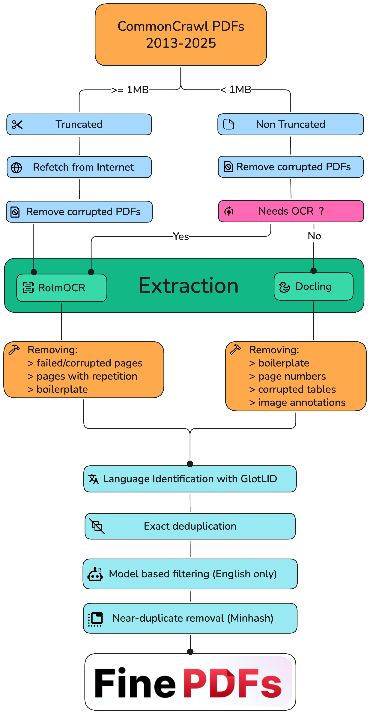

# A Treatise On ML Data Infrastructure

<br>

If you want to do machine learning, you need a lot of data.

If you need a lot of data, someone must collect and process a lot of data.

If someone must collect and process a lot of data, they need infrastructure.

Here is a way to build that infrastructure.

<br>


## Scalingpill Me

Data work is unsexy. Why do it?

I don't know. Depends on what you want to spend your time on I guess. But here are some potential reasons.

Any research lab needs a good dataset. Having good data gives you an edge. After all, <a href="https://nonint.com/2023/06/10/the-it-in-ai-models-is-the-dataset/">the model is the dataset</a>. And so every lab must dedicate resources to building data pipelines to process hundreds or thousands of petabytes. Or they must buy data from someone else,
<a href="https://www.deeplearning.ai/the-batch/openai-licenses-financial-times-archive-in-fifth-deal-with-major-news-publishers/">at</a>
<a href="https://www.forbes.com/sites/janakirammsv/2025/06/23/meta-invests-14-billion-in-scale-ai-to-strengthen-model-training/">exorbitant</a>
<a href="https://www.reuters.com/technology/reddit-ai-content-licensing-deal-with-google-sources-say-2024-02-22/">cost</a>. And who knows if it's going to be any good.

In the ML world, we are very scalingpilled. There are some things that are very appealing about scaling data collection and processing. Given these things, I am rather surprised why more people are not scaling along this axis, or at least talking more about it.


### 1. It's cheap.

Storage is cheap. CPU compute is cheap. Even inference has become really cheap. The only thing that hasn't become super cheap is time on densely interconnected GPUs, and we don't need that for data work.

The most expensive thing, honestly, is the labor. It's you, sitting there, writing the data procurement and processing scripts, pulling your hair out over scale and fault tolerance issues. Compared to NVL72 B200 time, even the costs paid in human suffering are cheap, and once you have written the infrastructure the cost to maintain it is much more manageable.

### 2. The data you collect for BigModel 1 can be used to train BigModel 2.

The compute that you spend training a model is all thrown out when you train its successor. This is not true of data. As long as you've got it on a drive somewhere, you can use it again. Maybe you will need more. Maybe you'd like to filter it differently this time. But it's a nonzero contribution toward the goal.

### 3. Data filtering is OP.

Suppose you need 10 TB of data to train a model. Would you rather scrape 10 TB of data, or scrape 1000 TB of data and filter it down to 10 TB. Which will make the better model? Remember, collecting and processing this data is super cheap.

How exactly you filter this data matters a lot of course. Perhaps more than anything else. There are plenty of experiments to be done here.

This is, as I understand it,
<a href="https://www.datologyai.com">Datology AI</a>'s entire business model. Large scale data filtering is
<a href="https://www.datologyai.com/blog/clip-gets-a-data-upgrade-outperforming-sota-with-improved-data-curation-only">very</a>
<a href="https://www.datologyai.com/blog/technical-deep-dive-curating-our-way-to-a-state-of-the-art-text-dataset">powerful</a>.

### 4. Stay on the Chinchilla-optimality curve

Having enough data matters. It matters a lot. It's well known in the ML community that
<a href="https://www.youtube.com/watch?v=cHgCbDWejIs&t=1348s">GPT-4.5 flopped because of OpenAI did not have enough high quality data</a>.
Orion (4.5) was supposed to be GPT-5, and if you spend time on deep learning twitter you know that everyone knows it. It failed because of data quality and a bet on overparameterization that didn't play out.


The Chinchilla paper states very simply that to train a bigger model you need more data. To stay in the compute optimal regime, the amount of data you need is proportional to the parameter count, leading to logarithmic improvements in the loss.
This results in a quadratic (or more when you consider the memory ramifications of backprop) increase in the cost of training.

Let's think about what this means in practice though. The Chinchilla paper makes one load bearing assumption which is almost never true in practice. It assumes that all data is created equal.

Clearly this is not true. Labs aren't dumb, they will use the best data they have available. Recall that data filtering is OP. Suppose you scrape your 1000 TB, and filter it down to 10 TB. Now suppose we decide to double the size of the model. Now we need 20 TB to stay in the same spot on the Chinchilla scaling curve. But half of the data in this new larger dataset is low enough quality that we would have previously thrown it out. This bigger dataset is worse.

It's actually quite miraculous though that in the compute optimal regime to double the size of your model you only need to collect twice as much data. I feel that people take this for granted. Neural networks are doing compression, and compression does not work like this. Compressors typically get more efficient as you put more data into them. It surprising, to me at least, that the Chinchilla scaling dynamics do not work this way.

Really though, whatever your interpretation of the scaling laws, you should be collecting even more data so you can overtrain a bit. Most labs are doing this, and it makes sense to do so if you're training a model that a lot of people are going to use. Yet it may not make sense to overtrain by *too* much, or you'll end up in a Llama3 situation where the model does not quantize well.

TODO: Add sources for claim above.


### 5. You can't scrape retroactively.

The internet of today cannot be collected tomorrow. Scrape or regret. Archive whatever you can get your hands on, while you still can, even if you aren't going to be able to use it right away. You may need it later.

It is true that we now live in an era unlike the 2022-2023 scaling era where random undifferentiated internet data is not as valuable. Frontier datasets are very high quality, and actually not that much high quality data exists on the internet. But I think this point still applies.


## Immediate Growing Pains

Now that we've gotten why we're scaling data out of the way, let's talk about how to do it.

How to write code to process a gigabyte of data is common knowledge. You just do the thing, and it does the thing.

```py
with open("input.txt", 'r') as f:
  data = f.read()

res = process_data(data)

with open("output.txt", 'w') as f:
  f.write(res)
```

You can get away with this until you hit the memory wall. Eventually it is no longer possible to fit the full dataset in memory, and you have to stream it sample by sample. You may not have tens or thousands of terabytes of RAM lying around after all.

```py
with open("input.txt", 'r') as f_in:
  with open("output.txt", 'w') as f_out:
    for line in f_in:
      processed_line = process_data(line)
      f_out.write(processed_line)
```

Not too long after, you're going to hit another wall. It's slow. You're bottlenecked on something. Probably disk speed or memory bandwidth. If you're processing data on the GPU, it's VRAM bandwidth, PCIE bandwidth, or actual compute. In any case, it's going to be very slow if you have a lot of data to get through. So, you go to speed it up.

```py
from multiprocessing import Pool

with open("input.txt", 'r') as f_in:
  with open("output.txt", 'w') as f_out:
    with Pool() as pool:
      for result in pool.imap(process_data, f_in):
        f_out.write(result)
```

You can probably process a few terabytes this way if you leave it overnight. But it isn't enough. You crave more. NEED more. Your thirst for data is only intensifying.

There's also the question of where you got the data in the first place. Web scraper, perhaps? That can only go so fast. You'll get rate limited, or bottlenecked on transfer speeds, or something. There are bottlenecks everywhere.

Clearly the only thing to do is to scale out to many machines. But this raises its own challenges.


## Fault Tolerance

The above sounds basic. And actually, it is.

The problem is that to do this at scale you're going to be adding a whole bunch of intermediate steps inbetween. Those steps are going to introduce a bunch of potential for error, and therefore complications. You have to get everything right, because at a large enough scale anything that can go wrong will go wrong. You will burn for your sins. Drives fail. Networks are spotty. If you don't figure this out, if you don't have a plan for it ahead of time, you will regret it.

Ideally, we want to be able set fire to any single computer, or drive, or few computers, or cut any cable, and keep the pipeline still running (or stalled but consistent), without data loss or corruption.

<br>
<div style="text-align: center;">
<figure>

<figcaption aria-hidden="true">Part of a still-functional data pipeline.</figcaption>
</figure>
</div>
<br>

How close you get to this ideal depends on your needs. But I think that people tend to make the mistake of underestimating the problem, and underestimating their needs. They assume that some potential data loss in X or Y case is acceptable, only to run into issues. Either immediately due to network or device instability, or later when they have to scale up and hit a bottleneck. In my experience, it is better to be paranoid from the start.


## Allowable Algorithms

One idea for data filtering might come to mind that's something along the lines of "For every piece of text, calculate its distance in embedding space from every other piece of text, and delete the ones that are too close."

This is a great idea! It doesn't work though. It's an `O(n^2)` algorithm, and `n` is many terabytes. So, ya know, good luck with that.

Similarly, consider sorting. It's `O(n * log n)`. You can do it. It just takes a long time, and it requires a lot of copying. You're also going to have to figure out how to orchestrate it across a bunch of machines. Kind of a pain. If you need to, you can do it. But you probably don't need to, so in general try not to bother. Just store it in whatever order.

You're probably going to have to shuffle though. An efficient way to do this is to shuffle the indices. This scales pretty well, onto a point. The potentially more scalable way to do this is that there are PRNGs that can be seeded such that they hit every number within their range exactly once before repeating. You can derive a new ordering from this.

Many algorithms need to be rethought in this way. Especially once you get to the point where you can no longer even fit all the data indices in memory. You have to stream the indices from disk as well. Given this limitation, you're probably not going to be able to do anything too complicated. So, keep it extremely simple.


## Storage

Believe it or not, problems are the same ones that databases deal with. Over the past 50 years or so the database community has developed a rich literature describing the solutions to these problems. I absolutely hate databases, but we need a database or similar.

There's also another fairly obvious solution, Amazon S3. Databases generally are optimized for lookup, for running queries on them. Object storage systems have no such requirements for complex indexing, and so can achieve much higher performance. We need an object storage system that has replication, sharding, and can handle high throughput.

<br>
<div style="text-align: center;">
<figure>

<figcaption aria-hidden="true">Leather Daddy Jeff makes his dramatic entrance.</figcaption>
</figure>
</div>
<br>

Sending Bezos money though? I hate that dude. I don't care how rich and buff he is. Okay maybe that part is kinda hot. He looks good in leather too. Not really into the whole Lex Luther vibe though. Anyway, I digress. Storage.

Storing that much data with Amazon is very expensive. The cheapest S3 tier appears to be $23/TB/month. So $276,000/PB/year. Common crawl is 9.69 PiB. So, 2.67 million dollars a year. And that's before the cost of actually using it ($0.005 per 1,000 writes, $0.0004 per 1,000 reads), which is also rather substantial. Big Jeff will fuck your Claude and your wallet. Let's pass.

If you don't want to be leather daddy Bezos's paypig, you gotta build your own S3. For this, I recommend a solution like <a href="https://github.com/minio/minio">MinIO</a>. You will need a load balancer in front of it, and you will have to build your own servers, but if you're storing and processing enough data it will be worth it.


## Producers and Consumers

Let's talk about how to put the pipeline together. I call it a pipeline because it is an apt description, and because other people seem to be calling it that.

First, we need a data source. This could be a scraper, or perhaps a dataset from HuggingFace or Common Crawl or similar. It could be coming in over the network, or you might have it on disk. In any case, we have a stream of data, arriving to another process running on another machine, or the same machine, asynchronously. We want to read asynchronously because that way if reading or processing data is a bottleneck we can maximize the amount of time spent doing that.

This is the first spot where we have to make a decision. Suppose the data arrives faster than we can process it. How should we deal with this situation? There are a few resolutions to the producer/consumer problem, and how you wish to resolve it may depend on the situation. But it comes up in almost every situation.

### Specific examples

Suppose you've got a bunch of scrapers sending data to your load balancer, which store it to MinIO to be processed and filtered by workers. This could work depending on the amount of data you're working with. It works until your drives fill up. If you're processing enough data, if it's petabytes and petabytes, even if you do not run out of storage you may damage your SSDs by writing so much. As such, if you must buffer the data, it's better to use HDDs. But HDDs do not write very fast, and may bottleneck you. The more economical thing to do is to make sure it never gets stored to disk at all, at least until it's been filtered somewhat.

Another scenario. Suppose you've got the data on disk, and you're reading it. Buffering to disk if the producer outpaces the consumer doesn't make sense, because... it's already there. You want to tell it to stop reading until you need more data. There has to be some mechanism for the consumer to signal to the producer to speed up or slow down.

### Observations

I would also argue that it would be very helpful to be able to compose this abstraction any way we like between various producers and consumers, in a polymorphic manner.

It would also be nice to be able to do layout optimizations on streaming the data around. In the same process? Use a ring buffer, and block the producer thread if it fills up. On the same machine? Send it over a pipe. On the same network? Send it over QUIC. Not on the same network? Figure a way to exchange IPs.

Another thing that comes to mind is that we are slowly reinventing [Datatrove](https://github.com/huggingface/datatrove). Perhaps a somewhat more advanced version of Datatrove. I don't think it supports everything I've talked about. But we are solving the same problem in the same way, and Datatrove is already battle tested on thousands of petabytes for this purpose by Huggingface. If you did not know about datatrove, you are welcome, now you know.


## Putting A Pipeline Together

Of course, you're going to want something to orchestrate all this. At first I thought Kubernetes may be an option. The problem is that the processes will not be able to see each other if they are in different containers. I think you end up building a megacontainer, handling all the services on that machine. In which case, what exactly is the point of kubernetes? You're better off provisioning machines and deploying through whatever the API of your platform is, or building your own.

I think what we really want is a server that keeps track of the pipeline topology, manages it, and assigns new containers a set of processes or services to run, and decides how they will communicate and with what.

This is already something that makes sense to build because we need to handle backpressure. So, building your own orchestration might not be much harder than that. Just have the server start and monitor and kill and scale and relink the various pipeline processes. There is some extra fault tolerance trickery here because we just introduced a single point of failure, but it's nothing that can't be overcome.


An example pipeline might look like:

```
          ┌────────────────────┬────────────────────────┬───────────────┐
          │                    │                        │               │
          ▼                    ▼                        ▼               │
┌─────────────────┐    ┌─────────────────┐    ┌─────────────────┐       │
│   Web Scrapers  │    │ HuggingFace API │    │  Local Datasets │       │
│  (CommonCrawl,  │    │   Streaming     │    │   (Sharded)     │       │
│    Reddit, etc) │    │                 │    │                 │       │
└─────────┬───────┘    └─────────┬───────┘    └─────────┬───────┘       │
          │                      │                      │               │
          └─────────┬────────────┘                      │               │
                    │                                   │               │
                    ▼                                   │               │
          ┌─────────────────────┐                       │               │
          │   Load Balancer     │◄─────────────────┐    │               │
          └─────────┬───────────┘                  │    │               │
                    │                              │    │               │
                    ▼                              │    │               │
          ┌─────────────────────┐                  │    │               │
          │   Format, Clean,    │◄─────────────────┤    │               │
          │    Extract Text     │◄─────────────────├────┘               │
          └─────────┬───────────┘                  │                    │
                    │                              │                    │
                    ▼                              ├────────────────────┘
          ┌─────────────────────┐                  │
          │   Quality Filter    │◄─────────────────┤
          └─────────┬───────────┘                  │
                    │                              │
                    ▼                              │
          ┌─────────────────────┐                  │
          │   Load Balancer     │◄─────────────────┤
          └─────────┬───────────┘                  │
                    │                              │
                    ▼                              │
          ┌─────────────────────┐                  │
          │   MinIO Cluster     │◄─────────────────┤
          └─────────┬───────────┘                  │
                    │                              │
                    ▼                              │
          ┌─────────────────────┐                  │
          │  Embedding Model    │◄─────────────────┤
          └─────────┬───────────┘                  │
                    │                              │
                    ▼                              │
          ┌─────────────────────┐                  │
          │   Vector DB         │◄─────────────────┤
          │(Weaviate or similar)│                  │
          └─────────┬───────────┘                  │
                    │                              │
                    ▼                              │
          ┌─────────────────────┐   ┌─────────────────────┐
          │   Final MinIO       │   │  Pipeline Manager   │
          │  Object Store       │   │      Server         │
          └─────────────────────┘   │ (Scaling Control &  │
                                    │ Backpressure Mgmt)  │
                                    └─────────────────────┘
```

## Another Realistic Workload

<br>
<div style="text-align: center;">

</div>
<br>

For an example of the actual data processing that you'd be doing to build a machine learning dataset

I recommend checking out the [finepdfs](https://github.com/huggingface/finepdfs) technical report as an example of the sort of data processing you'd be doing to build a machine learning dataset. They released it while I was writing this, and I've got to throw them a mention. It's cool to read their code and see how they dealt with some of the problems described earlier.


## "You Should Build this"

No, lmao. This is hard. This is the effort of a whole-ass startup. I do not half-ass.

I would do it though if someone wanted to fund or hire me, or give me money to build it for them. I could be convinced. It's work that I love doing, I just don't have a personal use for hundreds of terabytes of high quality training data. Yet surely someone else does.

If you are interested, you can contact me with inquiries <a href="mailto:aarpazdera@gmail.com">here</a>.
