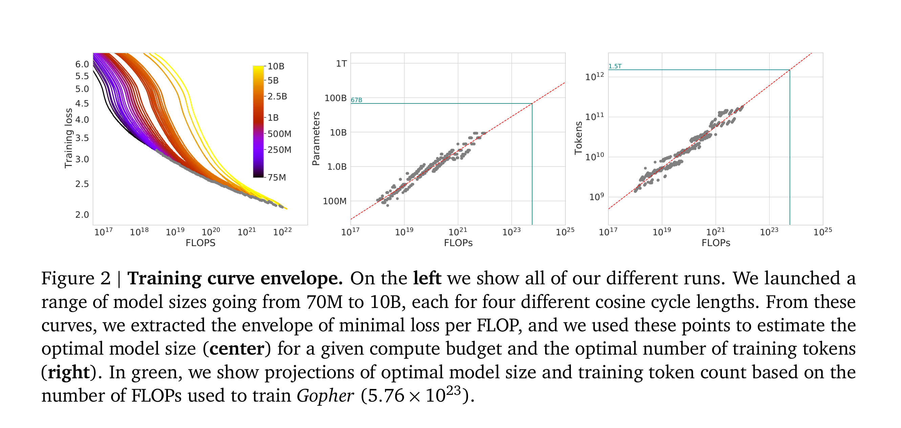
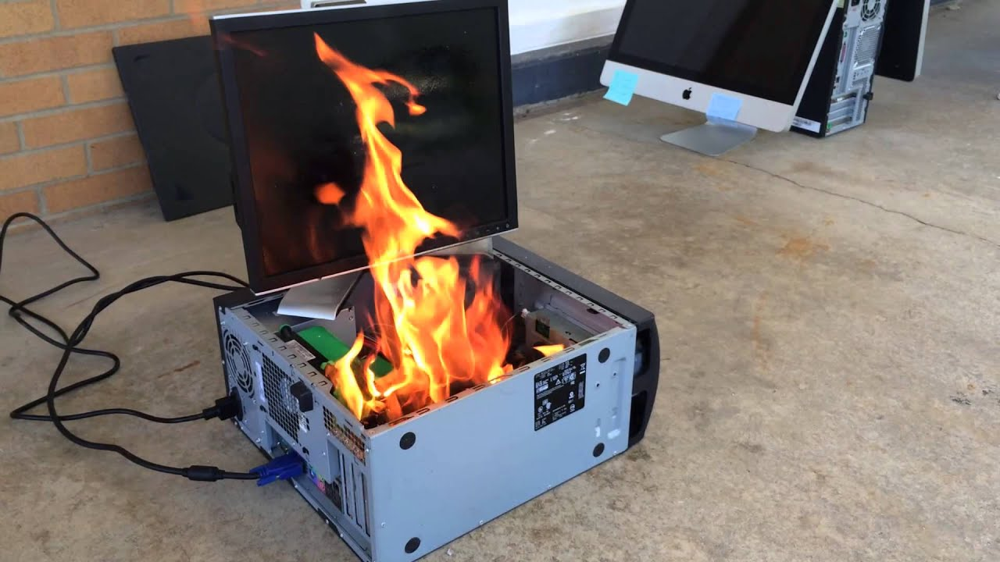

# A Treatise On ML Data Infrastructure

<br>

If you want to do machine learning, you need a lot of data.

If you need a lot of data, someone must collect and process a lot of data. 

If someone must collect and process a lot of data, they need infrastructure.

Here is a way to build that infrastructure.

<br>


## Scalingpill Me

Data work is unsexy, in much the same way that sex work is considered unsexy. Why do it?

IDK. Depends on what you want to spend your time on I guess. But here are some reasons.

Any research lab needs a good dataset. Having good data gives you an edge. After all, <a href="https://nonint.com/2023/06/10/the-it-in-ai-models-is-the-dataset/">the model is the dataset</a> And so every lab must dedicate resources to building data pipelines to process hundreds or thousands of terabytes. Or they must buy it from someone else,
<a href="https://www.deeplearning.ai/the-batch/openai-licenses-financial-times-archive-in-fifth-deal-with-major-news-publishers/">at</a>
<a href="https://www.forbes.com/sites/janakirammsv/2025/06/23/meta-invests-14-billion-in-scale-ai-to-strengthen-model-training/">exorbitant</a>
<a href="https://www.reuters.com/technology/reddit-ai-content-licensing-deal-with-google-sources-say-2024-02-22/">cost</a>.

In the ML world, we are very scalingpilled. There are some things that are very appealing about scaling data collection and processing. Given these things, I am rather surprised why more people are not scaling along this axis, or at least talking more about it.


### 1. It's cheap.

Storage is cheap. CPU compute is cheap. Even inference has become really cheap. H100 time is cheap nowadays too. The only thing that hasn't become super cheap is time on densely interconnected GPUs, and we don't need that for data work.

The most expensive thing, honestly, is the labor. It's you, sitting there, writing the data procurement and processing scripts, pulling your hair out over scale and fault tolerance issues. Compared to NVL B200 time, the cost is negligible, and once you have written the infrastructure the cost is close to zero.

### 2. The data you collect for BigModel 1 can be used to train BigModel 2.

The compute that you spend training a model is all thrown out when you train its successor. This is not true of data. As long as you've got it on a drive somewhere, you can use it again. Maybe you will need more. Maybe you'd like to filter it differently this time. But it's a nonzero contribution toward the goal.

### 3. Data filtering is OP.

Suppose you need 10 TB of data to train a model. Would you rather scrape 10 TB of data, or scrape 1000 TB of data and filter it down to 10 TB. Which will make the better model? Remember, collecting and processing this data is super cheap.

How exactly you filter this data matters a lot of course. There are plenty of experiments to be done here. This is, as I understand it,
<a href="www.datologyai.com">Datology AI</a>'s entire business model. Large scale data filtering is
<a href="https://www.datologyai.com/blog/technical-deep-dive-curating-our-way-to-a-state-of-the-art-text-dataset">very</a>
<a href="">powerful</a>.

### 4. Stay on the Chinchilla-optimality curve



The Chinchilla paper states very simply that to train a bigger model, you need more data. To stay in the compute optimal regime, the amount of data you need is proportional to the parameter count, leading to logarithmic improvements in the loss.
This results in a quadratic (or more when you consider the memory ramifications of backprop) increase in the cost of training.

Let's think about what this means in practice though. The Chincilla paper makes one load bearing assumption which is almost never true in practice. It assumes that all data is created equal.

But, this is clearly not true. Labs aren't dumb. Recall that data filtering is OP. Suppose you scrape your 1000 TB, and filter it down to 10 TB. In Chinchilla, on the models they were training, for every parameter they needed ~20 tokens to stay on the compute optimality curve. Now suppose we decide to double the size of the model. We need about twice as much data. Half of the data in this new larger dataset is such low quality that we would have previously thrown it out. The dataset is worse.

This effect matters. It matters a lot. It's well known in the ML community that
<a href="https://www.youtube.com/watch?v=cHgCbDWejIs&t=1348s">GPT-4.5 flopped because of this</a>.
Orion (4.5) was supposed to be GPT-5, and everyone knows it. It failed because of data quality and a bet on overparameterization that didn't play out.

How can you resolve this issue and resolve the data quality issue so you can double the size of your model? Easy. Collect twice as much data.

### 5. You can't scrape retroactively.

The internet of today cannot be collected tomorrow. Scrape or regret. Archive whatever you can get your hands on, while you still can.

It is true that we now live in an era unlike the 2022-2023 scaling era where random undifferentiated internet data is not as valuable. Frontier datasets are very high quality, and actually not that much high quality data exists on the internet. But I think the point still applies.

## Immediate Growing Pains

Now that we've gotten why we're doing this out of the way, let's talk about how to do it.

How to write code to process a gigabyte of data is common knowledge. You just do the thing, and it does the thing.

```py
with open("input.txt", 'r') as f:
  data = f.read()

res = process_data(data)

with open("output.txt", 'w') as f:
  f.write(res)
```

You can get away with this until you hit the memory wall. Eventually it is no longer possible to fit the full dataset in memory, and you have to stream it sample by sample. You will not have tens or thousands of terabytes lying around, after all.

```py
with open("input.txt", 'r') as f_in:
  with open("output.txt", 'w') as f_out:
    for line in f_in:
      processed_line = process_data(line)
      f_out.write(processed_line)
```

Not too long after, you're going to hit another wall. It's slow. You're bottlenecked on something. Probably disk speed or memory bandwidth. If you're processing data on the GPU, it's VRAM bandwidth, PCIE bandwidth, or actual compute. In any case, it's going to be very slow if you have a lot of data to get through. So, you go to speed it up.

```py
from multiprocessing import Pool

with open("input.txt", 'r') as f_in:
  with open("output.txt", 'w') as f_out:
    with Pool() as pool:
      for result in pool.imap(process_data, f_in):
        f_out.write(result)
```

You can probably process a few terabytes this way if you leave it overnight. But it isn't enough. You crave more. NEED more.

There's also the question of where you got the data in the first place. Web scraper, perhaps? That can only go so fast. You'll get rate limited, or bottlenecked on transfer speeds, or something. There are bottlenecks everywhere.

Clearly the only thing to do is to scale out to many machines. But this raises its own challenges.


## Fault Tolerance

The above sounds basic. And actually, it is. 

The problem is that to do this at scale you're going to be adding a whole bunch of intermediate steps inbetween. Those steps are going to introduce a bunch of of complications, and the potential for error. You have to get everything right, because at a large enough scale anything that can go wrong will go wrong. You will burn for your sins. Drives fail. Networks are spotty. If you don't figure this out, if you don't have a plan for it ahead of time, you will regret it.

Ideally, we want to be able set fire to any single computer, or drive, or few computers, or cut any cable, and keep the pipeline still running (or stalled but consistent), without data loss or corruption.

<br>
<div style="text-align: center;">
<figure>

<figcaption aria-hidden="true">Part of a still-functional data pipeline.</figcaption>
</figure>
</div>
<br>

How close you get to this ideal depends on your needs. But I think that people tend to make the mistake of underestimating the problem, and underestimating their needs. They assume that some potential data loss in X or Y case is acceptable, only to run into issues either immediately when some network or device instability occurs. Or they run into it later when they have to scale up further and hit a bottleneck. In my experience, it is better to be paranoid from the start.

## Storage

Believe it or not, problems are the same ones that databases deal with. Over the past 50 years or so they have developed a rich literature describing the solutions to these
problems. I absolutely hate databases, but we need a database or similar.

There's also another fairly obvious solution, Amazon S3. Databases generally are optimized for running queries on them. Object storage systems have no such limitations. We need an object storage system that has replication, sharding, and can handle high throughput.

<br>
<div style="text-align: center;">
<figure>

<figcaption aria-hidden="true">Leather Daddy Jeff makes his dramatic entrance.</figcaption>
</figure>
</div>
<br>

Fuck sending Bezos money though. I hate that dude. I don't care how rich and buff he is. Okay maybe that part is kinda hot. He looks good in leather. But why is he so boring otherwise? Kind of a turnoff. I don't like his wife either. The lip filler is objectifying, I think. Anyway, I digress. Storage.

Sky — 12:53 AMMonday, October 20, 2025 at 12:53 AM
Hey there
Storing that much data with Amazon is very expensive. The cheapest S3 tier appears to be $23/TB/month. So $276,000/PB/year. That's before the cost of actually using it ($0.005 per 1,000 writes, $0.0004 per 1,000 reads), which is also substantial. Big Jeff will fuck your Claude and your wallet. Let's pass.

If you don't want to be leather daddy Bezos's paypig, you gotta build your own S3. For this, I recommend a solution like
<a href="https://github.com/minio/minio">MinIO</a>. You will have to build your own servers, but if you're storing and processing enough data it will be worth it.

## Performance Considerations

* Data movement optimizations

* Producer Consumer Problem/Asynchrony

## Putting It All Together

* Just describe everything, from scraping through synthetic data


## You Should Build this

No, lmao. This shit is hard. This is a whole ass startup.

I would do it though if someone wanted to fund or hire me, or give me like a million dollars to build it for them. I could be convinced.

You can contact me with inquiries <a href="mailto:aarpazdera@gmail.com">here</a>.
