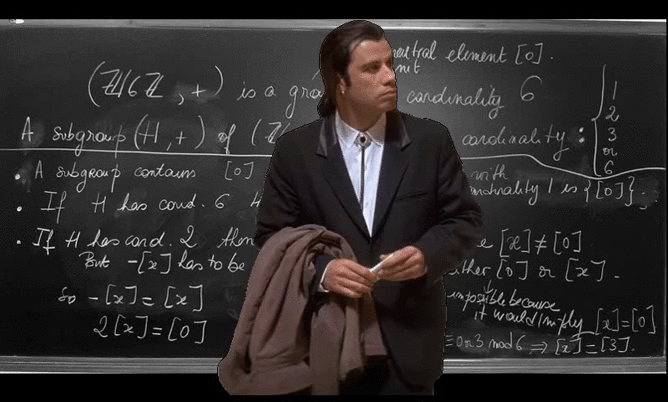
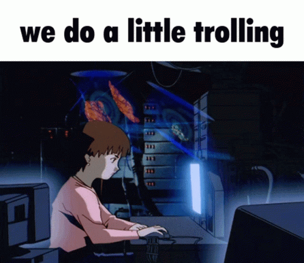
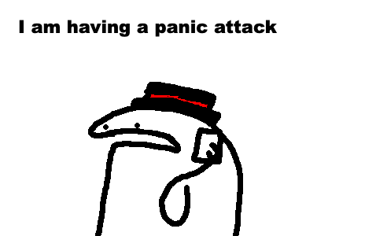

# Descending Into the Stack and Madness

AS-Safe glibc stack traces. A descent into madness. A death by a thousand cuts.

Call me melodramatic, but all I want is a nice, pretty, formatted backtrace
from a signal handler.

What am I to do?


# Background

### What is a signal handler?

Here's an example.

```c
#include <stdio.h>
#include <signal.h>

void handle_sigint(int sig) {
  printf("Received SIGINT\n");
}

int main() {
  signal(SIGINT, handle_sigint);
  while (1); // Loop forever
  return 0;
}
```

If you compile and run this, you'll see "Recieved SIGINT\n" whenever it receives one,
which you can do by pressing `ctrl + c` in your terminal. You can send it `SIGQUIT` to
exit by pressing `ctrl + \`.

### What is signal safety?

It might surprise you to learn that the example given above is not signal-safe.
Why, and what does that mean?

First, open your terminal, and type `man signal-safety`. Read it. Read it all.
It could, metaphorically speaking, save your life. Or a few hours debugging.

<div style="text-align: center;">

</div>

And also the notes at the end.

<div style="text-align: center;">

</div>

While this man page does lay out a lot of crucial information, it leaves a lot to be
desired. What's actually more important than what's written there is what isn't. It also
explains what you aren't allowed to do, but doesn't explain why. Let's explain why.

The man page says:
```
If, at that moment, the program is interrupted by a signal handler
that also calls printf(3), then the second call to printf(3) will
operate on inconsistent data, with unpredictable results.
```

Why is this? I thought that `printf()` was threadsafe?

<div style="text-align: center;">
  
</div>

Well... it is. The problem is, signal handlers are not executed on a different thread.
They're actually executed on the *same* thread. On linux, always the main thread, unless
you cleverly configure signal masks. This means that mutexes are useless at preventing
race conditions from signal handlers. In fact, they are less than useless. When used
correctly, they deadlock.

Note that `man signal-safety` does not contain even a single mention of mutexes at all.
It should. It should provide a stern warning. Yet, it doesn't. I reiterate that even
more important than what's written there is what isn't.

Other functions are prone to these issues as well. `malloc()`, for example, is ALSO not
listed as AS-Safe in `man signal-safety`, for the same reasons as `printf()`. It's
inherently required to operate on global data, the bookkeeping for which could be
overwritten at any time and cannot be protected by a mutex. Losing `malloc()` rules
out most other libraries.

# Implementation

<div style="text-align: center;">

</div>

Now that we understand signal safety, let's think about what we need to do to implement
backtraces that can be obtained from a signal handler.

First, we need a library capable of tracing the stack. You could write this yourself.
However, it would require extensive knowledge of the specific platform, and would not
be portable. So, if you haven't also written your own platform, you should probably use
a library.

In practice, on ARM/x86/RISC-V/Whatever, you have a choice. You can either use glibc
(which is no doubt already installed unless you're using an all-musl distribution) or
`libunwind`. Since it's already installed, let's use glibc. To view the docs for the
glibc backtrace library, consult the manual once again and type `man backtrace` in your
terminal.

The glibc functions are `backtrace()`, `backtrace_symbols()`, `backtrace_symbols_fd()`.
The `backtrace_symbols()` function returns a `malloc()`ed array, so it's out of the
picture immediately. The rest of the functions are not documented as AS-Safe. But, I
went on IRC, asked the glibc maintainers about it, and they said it was safe.


### Some sort of shrug meme
<div style="text-align: center;">

</div>

So, we need to write to a file descriptor. Sure, I thought. How bad could it be? What
ensued was agony beyond reason, horror beyond imagination. Or something, I don't know.
Melodrama aside, it was much more difficult than I anticipated, and I think that I
found a small (but disproportionately painful) oversight in the POSIX standard.

## My Kingdom for a File Descriptor

We need to create a file descriptor to write into. How will we do that?

<div style="text-align: center;">

</div>


Ideally, the bits and bytes backing the file descriptor should remain in memory.
We should call `memfd_create()`. So, we look it up in `man signal-safety`, and...
It isn't there. It's not required by POSIX to be AS-Safe. That makes sense. It's
not even from posix, it's linux-specific, not portable, and so it wouldn't be listed.

The glibc implementation of `memfd_create()` is probably AS-Safe. Probably. I just read
the source, and it's a direct syscall. I could go ask the maintainers again to make sure.
But, even being a direct syscall isn't enough. Some syscalls are intercepted by libvdso.
And, besides, the POSIX standard doesn't know anything about syscalls. But, it might
actually be safe, depending on what guru you trust. Who is to say.

Anyway. It's not technically portable. It's not on the list. So, let's look for other
options. How about using `mkstemp()`?. It turns out, that isn't marked as AS-Safe either.
Strangely enough, if we want to create a file descriptor in a way that's fully AS-Safe,
we have to create a temp file, on disk, manually, with `open()`. I think that's a travesty.
What if the signal was sent because a disk error?

It pains me, but let's just call `memfd_create()` outside the signal handler and store it
to a global variable at the start of the program, before the signal handler is
registered and before it can be called. We already have to do some setup. We have to
preemptively load the library that glibc's `backtrace()` is implemented in, so we may
as well do a little extra.

Notably though, we now rely on global state. So, if the signal handler has to run on
multiple threads, or interrupts another signal handler, it'll clobber the memfile.
Luckily, `pthread_sigmask()` exists (and newly spun threads inherit the signal mask)
to make sure signal handlers run on only one thread by default. Also, and
`struct sigaction::sa_mask` exists so that the signal handling thread cannot be interrupted.
So, these are problems, but solvable ones.

### Insert meme about Bane and pthread_sigmask().


## Backtraces Time

Okay, so now we've called `backtrace()` and `backtrace_symbols_fd()`. Astounding. We
have symbol addresses. But they're printed into a temp file, whether it's a memfile or
a real file on disk. Now, all we have to do is parse them out. So I wrote the parser. It's
not that fancy.

### Insert "No file names?" No bitches meme

How do we get function names? Luckily there's a tool for this, and it's `addr2line`,
which is part of the ubiquitous GNU `binutils` package. If you're wondering if you have it,
you probably do. We have to shell out. But it's C, and we're sticking to posix. So, we do the
classic `pipe()`, `dup2()`, `fork()`, `exec()` song and dance. On the child end of the pipe,
we replace the execution image of the running process with that of `addr2line`. On the parent
end of the pipe, we parse the output printed into the temp file.

Agonizingly though, we're still not done. The `addr2line` tool doesn't canonicalize file
paths. This can be done with `realpath()`, but this is a signal handler, and it isn't listed
under `man signal-safety`. Excellent. So we implement it manually once again. And by
"implement it manually" what I really mean is steal it from a nerd on StackOverflow. It's
very plausible that the glibc implementation of `realpath()` is AS-Safe, but it takes less
effort to yoink an implementation than it does to check.

### Insert meme about stealing code


Now that we have all of this information, we can finally print the stack trace. But... it's
not like we can call `printf()`, even when we control the output file. Because it's still
technically not AS-Safe. Once again, the correct thing to do is to do all the formatting
manually, then call `write()` a single time on the output file descriptor.

Unfortunately, since we must call `write()` and not `printf()`, and `fflush()` is not AS-Safe
for good reason, there's no real way to deal with the fact that `stdout`, `stderr`, or
whatever other `FILE*` you're writing to the file descriptor of might have unflushed data.
Even if you could actually call `fflush()`, there would be no way to prevent another thread
from buffering more data to it before your `write()`, since mutexes are unsafe also. This
cannot be circumvented, in any way. So, there's the possibility that the bactrace you `write()`
to `stderr` gets mixed up with other output.

So... that's the implementation. Agony. Here's the [code](https://github.com/apaz-cli/daisho/blob/master/stdlib/Native/PreStart/Backtrace.h).

# Bonus Gotchas

1. Did you know that lazy library loading through the linker calls `malloc()`? Did you know
this fucks everything up? See my other article,
[The Craziest Bug I have Ever Witnessed](The_Craziest_Bug_I_Have_Ever_Witnessed.html),
where I found a bug in the julia runtime implementation of its own backtrace signal handler.

2. Did you know that signal handlers should not modify the value of `errno`? We need to
save the value of `errno` before we start doing things, and restore it after. This is
because signal handlers hijack the execution of a running thread. If `errno` is set in a
hijacked thread, it may appear as though a system call outside the signal hander has
failed, or vice-versa.

```c
#include <errno.h>

void signal_handler(int sig) {
  int fd = open("does_not_exist.txt", "r");
  assert(fd == -1);
  assert(errno == ENOENT);
}

void calling_thread(void) {
  errno = 0;
  int fd = open("file.txt", "r");

  /* Everything is fine, the file opened. */
  assert(fd != -1);
  assert(errno == 0);

  /* Thread hijacked */

  if (errno == ENOENT) {
    puts("AAAAAAAAGH FUCK HOW");
  }
}
```


# A Conclusion, of Sorts

If I committed the grave sin of accidentally publishing a factual inaccuracy, I don't apologize.

### Insert "Me when spreading misinformation on the internet" meme

Signals are hard. I wish they weren't. I spent too much time implementing this, and too much
time writing this article. I'm done. Let me know on Discord if you find an inaccuracy, but
I'm not rewriting this post or the accompanying [code](https://github.com/apaz-cli/daisho/blob/master/stdlib/Native/PreStart/Backtrace.h),
I've already done it too many times. Use it for whatever you want.


# Bonus Gotchas


* Takeaways, and the implementation:
  * Okay, that was a lot. So, here you go. Here's the code.
    * [code](https://github.com/apaz-cli/daisho/blob/master/stdlib/Native/PreStart/Backtrace.h)
  * Do not do any work in signal handlers, unless you really really know what you are doing.
    Ideally, set a flag and gtfo.
  * You can also choose to do it like I do, but honestly don't. It's absolute purgatory.

I hope that you find this useful. May you never feel my pain.


