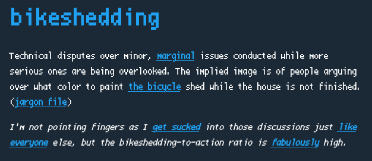

# How to Write a Compiler Without Going Insane
#### There are plenty of tutorials out there on how to write compilers. They're all mostly the same.

Usually, the pipeline looks something like:

* Raw text -> Tokens
* Tokens -> Abstract Syntax Tree
* Abstract Syntax Tree -> Symbol Tables, IR, Control Flow Graph (CFG)
* Unoptimized IR / CFG -> Optimized IR / CFG
* Optimized IR / CFG -> Target
 

    You can add, subtract, swap out, or combine steps, obsess over details, and argue over semantics all you like, but everyone agrees that's roughly how you make a compiler. There's a set of data structures, algorithms, and techniques that everyone uses, mixes, and matches. Learning to build compilers is mostly about getting comfortable with them.

    This article is not about that. It's an unhinged rant about how to get all of that nonsense accomplished without ending up in a mental ward.

 

## Why are compiler authors their own worst enemies?

    If you're the sort to write a compiler, you are not the sort to cope with imperfection. That's the reason you're here in the first place. It's a good thing. But it's also a very bad thing. Trying to get everything perfect in one go will crush you. Don't ask me how I know.

 

## The skills that you need are not technical skills.

They're project management skills.

    This is a Herculean undertaking. The amount of work is ridiculous. Each stage of the compilation pipeline is large enough to be a project of its own, and they all need to work together. Most programming projects are small enough that you can just write the code, it does the thing, and you can move on. Compilers are different. Mistakes compound, and can invalidate months of work if you're not careful.

 

## Resist scope creep

    This is perhaps the most important advice. Scope creep. Don't. You will feel to the urge to create endless complementary side projects. You could work on...

 * Editor support
 * Package Manager
 * Standard Library
 * Syntax Highlighting
 * Debugger
 * Language Server

    These can all be accomplished later, and are best accomplished by support from either multiple teams or large communities. Not by independent devs trying to do everything. Don't try to undertake all of these. You'll die. Limit the scope of what you're doing as much as you can.

 

## Don't argue over the color of the bike shed.

    There are a lot of decisions that are important. Mistakes can compound. Many mistakes however cannot compound. You don't have to get those decisions right on the first try.

    Often, compiler authors write languages for reasons of syntax. There's nothing wrong with that. However, the syntax of your language is not important to the way your compiler works. Any part of the syntax that you get wrong can be fixed later with minimal effort, and you'll end up with the same abstract syntax tree at the end of the parser anyway. Too many would-be language designers get stuck at this step. Do not spend too much time here. It is bikeshedding, and will consume you if you let it.

    To clarify, syntax is not something to spend time on, so long as there are no grammatical ambiguities. That is an issue which is an issue that actually could compound into further issues down the road. In general, whenever you need to make a decision, the time that you spend on it should be correlated to its importance.

 

## Plan out modular components

    Remember that part where I said "You can add, subtract, swap out, or combine steps, obsess over details, and argue over semantics all you like?" This is the part where you do that. The first step to writing any compiler is to plan out how all the different parts connect to each other.

    The calling of computer scientists is to take an insurmountable problem (like writing a compiler), split it into a few difficult problems (steps in the compilation pipeline), split those problems into less difficult problems (algorithms used to implement those steps), and solve those problems (implement the algorithms).

    Unless you're working with other developers and want to divide and conquer, you don't need to bust out the UML diagrams. But you do need a mental image of how the whole project will together. This same goes for any other software project.

    There's a lot of potential here to mess up in ways that could come back to haunt you. Forward planning should prevent most of them. But, there are also a lot of arbitrary decisions that don't matter. Should you use a GLR parser, a LALR parser, a packrat parser, or write your own with Pratt parsing or recursive decent? The truth is that it doesn't matter. What matters is that you get it done so that you can move on to the next step.

    I could have taken my own advice. Instead I succumbed to bikeshedding. I hated all the options so much that I spent six months writing my own parser generator called [pgen](https://github.com/apaz-cli/pgen). Don't make the same mistake that I did. If you find `pgen` helpful though, then I'm glad I could be of service.

 

## Manage your schedule

    Writing a compiler is a marathon, not a sprint. Much like deciding to run a marathon, you should probably first ask if this is a lifestyle decision that makes sense for you right now. Do you have time to set aside? Would you rather spend that time with friends or a significant other? If you want to write a compiler for a project to put on your resume, there are projects that look just as impressive and are at least 20x as time efficient.

    My advice is to only work on your compiler when you want to. But make every session count. Also, don't let other things in your life become neglected.

 

## Make incremental progress

    Marathons are long. But they are also peppered with landmarks along the way. Getting to each landmark is its own battle that gets you closer to the goal. I believe that the same approach applies to compiler development. What follows is my own opinion and my own system. You should find a system that works for you.

    It's important to keep track of both be big and small picture. I maintain two different TODO lists, one for each. Whenever I sit down to work on the project, I first spend a few minutes calling to mind and updating my mental model of the big picture, then decide on individual small tasks from the other list that I want to accomplish in that session. At the end of the session, before I step away from my laptop, I update the lists.

    Big picture tasks are easy to keep track of. If you've written a tokenizer and a parser, and it's time to move on to AST desugaring, then it's relatively easy to know where you are in the process. What requires more thought is dealing with change, finalizing parts of the API, and making sure that everything still makes sense at a macro scale.

    The small tasks are more difficult to keep track of. I find that I need to make a list, and oftentimes update it as I program, or I will forget most of it. Tasks on this list could be implementing certain functions or features, fixing bugs, testing functions or features, making decisions both large and small scale, and all the other tiny individual tasks that are part of the goal.

    Prioritizing and building a queue out of the small task list is a great way to contextualize the large task list, especially since some tasks on the small list are to make large decisions. Many of my tasks are literally just thinking about things like type systems, optimizations, etc. The thinking tasks should generally be about the things that you really don't want to get wrong. Don't bikeshed. If you can make a wrong decision without having to redo a lot of work, then just do so and don't feel bad about it.

 

## In Conclusion

 * Learn to cope with imperfection.
 * Constrain the scope of the work. Do not let it creep.
 * Don't bikeshed. You can always repaint the shed.
   * In particular, do not spend too much time on syntax.
 * Spend more time thinking about decisions that could be difficult to paint over later.
   * Make sure there are no large gaps in your understanding, or in data flow.
   * In particular, flesh out the internal APIs and representation of concepts in your language.
 * Manage your schedule.
   * Decide if you really want to do this.
   * Don't let yourself burn out.
 * Make incremental progress
   * Keep an eye on both the big picture and the small picture.
   * Find a system for accomplishing that which works for you.
 

I may have just reinvented basic project management principles, but I hope that this unhinged rant has been useful to you.

-apaz
