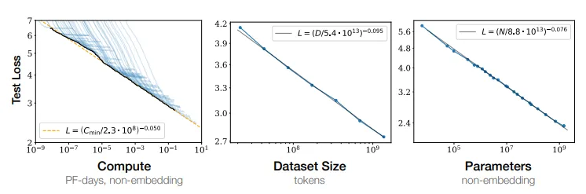

# Hyperparameter Heuristics

    It would be cool if there were a guide on heuristics for scaling training experiments.

    At the moment, the information is sort of trapped inside the heads and notebooks of individual researchers. Maybe a guide exists somewhere and I'm an idiot for not being able to 
find it. But this knowledge is certainly not as widespread as the projects (like litgpt which I maintain, or HF transformers, or torchtune) that researchers typically use for training 
and finetuning experiments.

    I assert that, in order to scale novel techniques, we need to be able to run hyperparameter sweeps on smaller models to figure out the optimal settings for larger models. I know 
that the choice of hyperparameters that's optimal for training a small model won't necessarily generalize to training a large model. But some of them do, and some of them change in 
predictable ways.

    There are heuristics that people use to make good guesses at what's optimal for larger models. The learning rate, for example, is highly dependent on the batch size 
and other aspects of numerical stability that change in a predictable fashion as you add parameters. What formula can we use to make a good guess? If something else changes, how can 
we rediscover the formula? These things are not very well known. There are certain papers (like Chinchilla for example) that contain a lot of these useful heuristics. But what about 
the people who have never heard of Chinchilla or the twenty other papers the heuristics are scattered across?

 

<figure>

<figcaption aria-hidden="true">The famous Chinchilla scaling laws are good examples of the heuristics I'm talking about.</figcaption>
</figure>

 

    Most of the time, people just copy over the hparams from training runs they know were successful. I think we can do better. People need to be able to discover their own hparams 
for their experiments, and they need to be able to verify the work of others. Given how frequently we need to do this, this should be made easy. It hasn't been made easy. As far as 
I'm aware, no good tools exist.

    I'm reminded of chemists that buy chemicals and then re-purify them themselves, because they don't trust the chemical companies. Although it's probably fine, what if it isn't? 
Your whole experiment is screwed, and you might not even know it. The same is very true with hparams. Always purify your chems and validate your hparams. Because sometimes, the 
hparams that get published are just wrong. I've had many conversations with people along the lines of "The learning rate in that paper was way too high, and there are better 
normalizations and initializations."

 

<figure>

<figcaption aria-hidden="true">Recrystallization is a common way of purifying chemicals, and looks pretty cool.</figcaption>
</figure>

 

    A lot of researchers just don't do hyperparameter sweeps. Either because they're too much effort, they're too expensive, or because even if they did perform HPO often the 
researchers don't know how to generalize the results to bigger models, more data, and more compute for when they need to scale up a training run. And they either don't know how to 
discover these relationships, or they just can't be bothered. Most people doing novel research do not know the scaling heuristics, and the only way to learn is to hear about 
individual papers by word of mouth. The result is that we just don't know what recipes are good vs bad.

    This problem can be solved. I think that a guide to hyperparameter scaling heuristics could increase the rigor of the field substantially, while also making it more accessible. 
There are plenty of HyperParameter Optimization (HPO) libraries out there, now we just need to learn how to use them.

    Unfortunately I'm not super familiar with the advancements in this part of the field. I haven't done any training experiments since 2019. I don't think I'm capable of solving this 
problem alone. My best guess is that it's already been solved internally at Anthropic, OpenAI, Google, and Meta. We have a lot of work to do in catching up, but I think most of the 
work is centralizing the information in a way that's both user friendly and rigorous.

