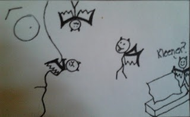
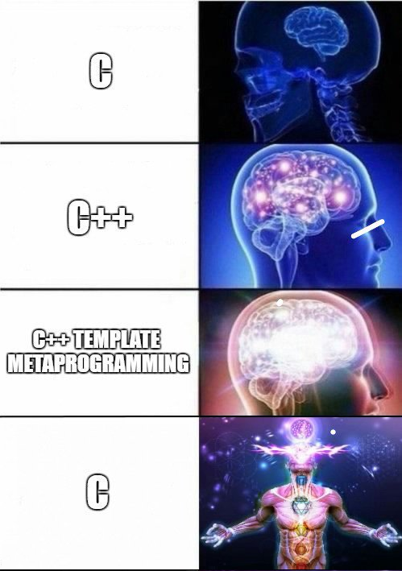
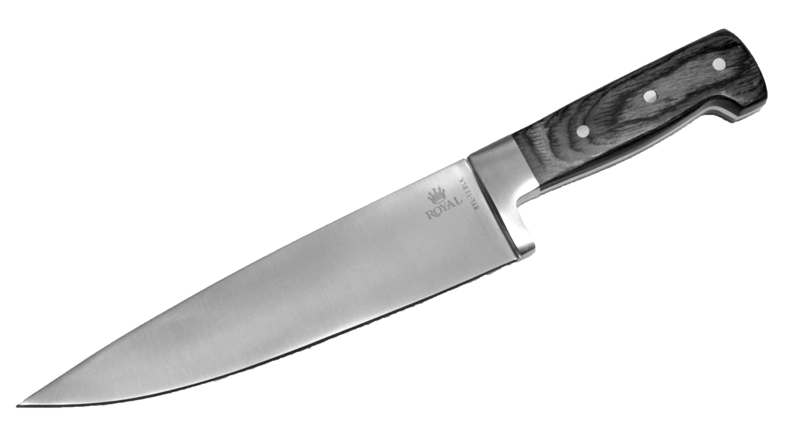
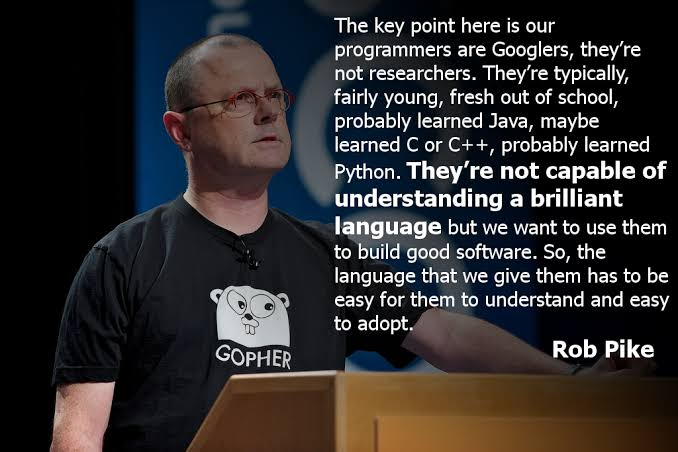

# Inspiration for the Stilts Programming Language


    For a long time, other programming languages have irked me. Usually in small ways.
Sometimes in very big ways. Every language that I've used has irked me in a big way at
least once. But, what annoyed me the most when I had a major problem was I couldn't
fix it. Even if the problem with the language was hypothetically very fixable.

    You can read all the problems I've had with Java in [the Java article](Java.html).
I'm about to talk a lot about C, but my time writing Java was equally inspirational.

<br>

    Eventually my disillusionment with Java led me to C. I came for speed. You might
say that I had a need for it. C delivered on the speed promise, but it was also a lot
more elegant than I expected. Everything is just ones and zeroes, and the language
doesn't disallow you from doing anything that you want with them. Knowing the layout
of each and every byte of memory is very useful.

<br>

    Every programming language has problems. In my Java article, I ranted about
Java's. Python is incredibly slow, and the lack of strict typing makes writing and
consuming large APIs difficult. Go is only just getting generics next month
(Feb 2022), absolutely crippling the language for a lot of uses. C++ syntax, APIs, UB,
and lifetime semantics  are absolute garbage, and the language itself adds very little
value on top of C. Opinionated languages like Rust and Haskell have trouble taking off
due to the learning curve, and generally take a lot longer to write a program in than
a minimally opinionated language with lots of features like Python. Every language has
problems.

    I think it's safe to say that C has two problems. First is that it takes so long
to get anything done. It's honestly absurd. The standard library doesn't have any
containers. If you want a list, or a set, or a hashmap, you've got to implement it
yourself. Traditionally you would have to implement it over and over again for each
type you need a list or a set or hashmap for. This gets old very fast, but it's a
solved problem in other languages.

    The other problem that C faces is undefined behavior. Even if you are already
intimately familiar with undefined behavior (UB), I recommend you read this incredible
series of articles by Chris Lattner, creator of LLVM. If you've heard of it but never
delved deep into it, then this view of UB might blow your mind a little bit.

<br>


  * [What Every C Programmer Should Know About Undefined Behavior #1/3](https://blog.llvm.org/2011/05/what-every-c-programmer-should-know.html)
  * [What Every C Programmer Should Know About Undefined Behavior #2/3](https://blog.llvm.org/2011/05/what-every-c-programmer-should-know_14.html)
  * [What Every C Programmer Should Know About Undefined Behavior #3/3](https://blog.llvm.org/2011/05/what-every-c-programmer-should-know_21.html)

<br>

Then, once you're done with those, head over to this article by Ralph Lieven to learn
about why it's a problem and the history of how it got to be this way.

<a href="https://raphlinus.github.io/programming/rust/2018/08/17/undefined-behavior.html">

</a>
[Anything is Possible with Undefined Behavior](https://raphlinus.github.io/programming/rust/2018/08/17/undefined-behavior.html)

<br>

    Perhaps the dirtiest secret of undefined behavior is... it's not that bad. Once
you know to avoid violations of strict aliasing, signed integer overflow, oversized
shifts, uninitialized variables, out of bounds accesses, and dereferencing null, it
gets better. With the exception of signed integer overflow and creation (not just
dereferencing) of invalid pointers, which is actually unintuitive to have to avoid,
good code doesn't contain these things anyway. Once you're used to it, it's not too
hard to write code that's free of UB. Unfortunately though, even when you think your
code is free of UB, there's no way to be certain.

<p align="center">

<br>
By the time they start coming out of <br> your nose, it's all over.
<br><br>
</p>

    However, once it's all said and done, once the nasal demons (an affectionate
term for UB bugs) have been vanquished, the finished C code that you're left with
is immensely valuable. It's probably incredibly fast, at least compared to other
languages, and as long as you've remained vigilant, it should also be very
portable. But it also probably took a very long time to write. What if there were
a way to write C code faster and safer, without taking a performance loss?

    Lots of languages have come and gone that claim to improve upon C in
exactly this way. C++ is of course the most successful of these languages, but
there are others. In a sense, my own language is no different. My friend
<a href="https://github.com/lerno" target="_blank" rel="noopener noreferrer">Christoffer</a> created a language called
<a href="https://github.com/c3lang/c3c" target="_blank" rel="noopener noreferrer">C3</a>,
which is also an inspiration for my own language. One of the big quality of life
upgrades from C3 that I'm considering for my own language is that it provides is
unified calling semantics for object methods. This would unify the C object design
pattern `OBJ_doThing(&this, with);` with the `obj.doThing(with);` syntax and perhaps
prevent some extra typing.

<br>


## Goals of Stilts

    I created Stilts because I want to right the wrongs of the other languages that
I've used. Specifically, the wrongs of C, Java, and C++.

    I've been asked over and over again "Why not just use C++?" I think that's a very
fair question. Initially, I thought to myself "because I want to write a programming
language." While it would have been okay to leave it at that, over time my thoughts on
the matter developed. After thinking about it some more, the answer I've settled on is
"Because I hate writing C++, and I don't want to do it anymore."

    Stilts and C++ have basically the same goals. A C-compatible language for writing
performant code faster. Additionally, C++ is a more mature and more powerful language
that can do anything Stilts can and more. But also, ask any C++ programmer about the
language's problems, and they won't be able to stop talking. Such a discussion would
probably be too lengthy for this article, and there is a 100% chance that it would
start fights. But I am not alone in my distaste. There have been
<a href="http://harmful.cat-v.org/software/c++/coders-at-work" target="_blank" rel="noopener noreferrer">many prominent voices</a>
in the programming community that have voiced the same opinion.

<p align="center">
<br>

<br>
I have found there's an incredible <br> amount of truth to this meme.
<br><br>
</p>

    Since I don't need to justify my dislike for C++ further, I will not. Instead, I
would prefer to re-evaluate what I need from a language, and make a fresh start. At
very least, I know that taking this plunge will make me a better programmer. Even if
Stilts never becomes usable.

<br>


## Characterizing Stilts Through Metaphor


<blockquote cite="http://www.paulgraham.com/trevrejavcov.html">
There are two kinds of programmers: brilliant hackers, and corporate drones. It's natural that they should want different kinds of tools.

As a hacker, you can only shine if you use the right tools. Don't let yourself be saddled with inappropriate tools by your management, and don't be led by the media into using the tools meant for drones.

Because there are 100x more drones than hackers, most new commercial technologies are aimed at them. You have to learn to quickly identify which tools are and aren't meant for you.

--Trevor Blackwell
</blockquote>


    To characterize the language I want to build through an overly dramatic extended
metaphor, I would compare Java and Stilts to knives. What I need is not a standardized
cooking knife so that anybody can pick up and use anybody else's knife. In fact, what
I'm really looking for is a katana so strong and sharp and thin that I can obliterate
my opponents faster than they can blink. I don't care if I accidentally knick my thumb
with it, or forget to type `delete`. I can bandage it up later. I also don't 
particularly care if my language is too dangerous for others to wield. They will
weild it and reap the benefits when they are strong enough.

<p align="center">


<br>
</p>

    Both tools solve a problem, and do it well. A standardized knife is useful to
companies who run kitchens (just like a standardized language is useful for
communicating with other programmers), a katana is useful to samurai (or to hackers,
in the older sense of the word from the 80s that doesn't imply a crime is being
committed).

    I suppose that if I were to extend the cheesy rōnin metaphor even further, a
samurai carries two two swords into battle, and a programmer carries two languages. A tachi (katana) and a wakazashi for the samurai, and a scripting language and a general
purpose language for production code for the programmer. Python is the wakazashi half
of my <a href="https://en.wikipedia.org/wiki/Daish%C5%8D" target="_blank" rel="noopener noreferrer">daishō</a>,
and I'm very happy with it. However, I've not found a suitable tachi to complete
the set. So, I'll make my own. My name may not be <a href="https://en.wikipedia.org/wiki/Masamune" target="_blank" rel="noopener noreferrer">Gorō Masamune</a> or  <a href="https://en.wikipedia.org/wiki/Dennis_Ritchie" target="_blank" rel="noopener noreferrer">Dennis Ritchie</a>,
but I'll do my best.

<p align="center">
<br>

<br>
Go is another example of a "Chef's knife" language.
<br><br>
</p>

    Since the the goal is to write C as quickly and efficiently as possible, a
number of things need to happen to facilitate this.
```md
* Clean Java-like APIs should be easy to write.
* Unlike C/C++, syntax should stay out of the user's way.
* Some of C's sharp edges should be smoothed over.
  * Particularly the nasal demons and memory bugs.
* The user should be able to know:
  * The layout and location of every bit (no surprises like C++)
  * The mapping between Stilts features and C design patterns
* Interop
  * Writing bindings to C libraries should be quick and easy.
  * Mixing Stilts and C together in the same file should be quick and easy.
```

    In the next article, I'm going to talk about how to accomplish these things.
