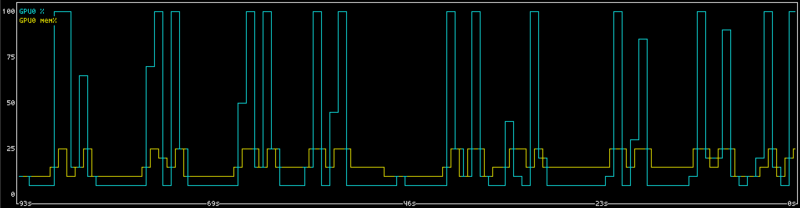
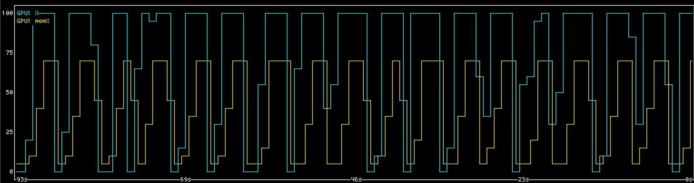

# Safe Speedy Kernel Autoresearch with LD_PRELOAD

How to keep autoresearch agents from stepping on each other's toes.

<br>


<br>

## The Problem

Autoresearch loops are great. But naive loops with one agent per GPU face hardware
utilization issues. The agent spends time thinking and doing other things, so cannot
keep the GPU busy 100% of the time. Ideally you want to be running multiple agents
per GPU. This achieves better hardware utilization, but creates some very obvious
problems.

The naive solution is to give the agent a tool or command to run, which gives them
exclusive access to a GPU. Tell the agent which GPU it should queue on, and tell
it to pass `CUDA_VISIBLE_DEVICES` or similar to the queue command. Then the queue
command does the bookkeeping necessary to keep the GPU busy while preventing overlap.
This is a step in the right direction, but again there are problems.


Who is to say the agent will actually use your queue command? Simply not using it
allows the agent to skip the queue. And if you instead run every command through this
queue command via the harness, what about long running commands that don't use the GPU?
Are you going to let the GPU sit idle all that time? I don't think either is a good idea.
A GPU queue should only queue GPU code. And it should not require your agents to cooperate.





This is what I have accomplished in [libgpumutex](https://github.com/apaz-cli/libgpumutex).
You can `pip install gpumutex` and use it right now. The single C file is also available
on [Github](https://github.com/apaz-cli/libgpumutex).


## Okay but how?

Before any code runs on an Nvidia GPU, the calling process must first initialize the
driver API with `cuInit()`. This is where we step in. If we can intercept `cuInit()`,
we can make it reserve a GPU, and set `CUDA_VISIBLE_DEVICES` right before CUDA actually
starts using it.

To do this, we must intercept the mechanism that the process uses to obtain a function
pointer to `cuInit()`. There are three different ways this might happen.

### 1. Static linking

You're fucked. But luckily nobody packages CUDA code this way. Nvidia does ship
`libcudart_static.a` with CUDA, but I don't think anybody actually uses it. The resulting
executable would not be portable between CUDA versions, or between machines. So although
we have no answer here, we also do not have to worry about it.

### 2. Dynamic linking

The dynamic linker on Linux (`ld.so`) exposes an environment variable, `LD_PRELOAD`,
which you can use to inject your own library, the symbols from which get loaded first.
So if we inject our own library, `libgpumutex.so`, when the process tries to resolve
the function pointer to `cuInit()`, it resolves to our `cuInit()` from `libgpumutex.so`.
Then this fake `cuInit()` calls the real `cuInit()` after waiting on an available GPU.

### 3. Lazy loading

Processes can also read and run code off the disk by calling `dlopen()`. When they do
this it does not consult `LD_PRELOAD`. `dlopen()` is a lower level thing, it just
maps the code from disk into executable memory pages. To obtain a function from the
loaded library, the process calls `dlsym()`, which looks the symbol up by name in the
library's dynamic symbol table and returns its address, which the processor can then jump
to. Unfortunately, this bypasses `LD_PRELOAD` entirely, which works through replacing
addresses in the process's Global Offset Table (GOT).

Luckily, `dlopen()` and `dlsym()` are themselves provided by `libc.so.6`. For a few
reasons, libc is almost always dynamically linked. This is very beneficial to us. In our
`LD_PRELOAD` library we can also intercept calls to `dlsym()`, check if they are loading
`cuInit()` from `libcuda.so.1`, and have it return our wrapped `cuInit()`, the one which
waits for an available GPU if they are before proceeding. This covers the other way a
pointer to `cuInit()` could be obtained by processes which the agent spawns with tool calls.

Intriguingly though, Nvidia's runtime API (`libcudart.so.13`, not the driver API
`libcuda.so.1`) does not always depend on `dlsym()`. It calls *different* functions
(`cuGetProcAddress()`, `cuGetProcAddress_v2()`) from the driver API which similarly bypass
the Global Offset Table to resolve symbols, like `dlsym()` does, but through libcuda's
own table lookup. We must override those functions too.


## Python?

To modify the behavior of `cuInit()`, we need to set `CUDA_VISIBLE_DEVICES`. We can do
that from C, simply call `setenv("CUDA_VISIBLE_DEVICES", devices, 1);`. That's easy.

But suppose we're trying to sandbox a python process. Suppose that python process calls
the CUDA drivers (`cuInit()`), then returns to python to spawn a subprocess. This could
be a problem, because although our environment variables did get edited by `setenv()`
on the operating system / C side, they did not get edited on the python side. Our
`os.environ` did not get updated. We're going to have to fix that.

But we're not writing a python library. We're writing a C library. How can we actually
update `os.environ["CUDA_VISIBLE_DEVICES"]`?

We must reach once again inside the address space of our own running executable.
Specifically, we check to see if we've loaded libpython. If we haven't, then this is not
a Python process, and there is no problem to solve. If we have loaded libpython though,
we can resolve symbols from it, and use them to edit `os.environ`.

Notably though, we do not actually need to link against libpython. We don't need the header
files either, because libpython has a stable ABI.


## The Code

With that, we finally have the solution we were looking for. We can give arbitrary processes
exclusive access to GPUs, without having to edit their code, and make them wait in line.
There are some things I didn't mention, like how I implemented a fair process queue system
with `flock()`, but in case you're wondering about that you can read the code.

You can find the code at [https://github.com/apaz-cli/libgpumutex](https://github.com/apaz-cli/libgpumutex).

The package is on [PyPI](https://pypi.org/project/gpumutex/). Install with `pip install gpumutex`.


```bibtex
@misc{pazdera2026ldpreload,
  author = {Pazdera, Aaron/Ana},
  title  = {Safe Speedy Kernel Autoresearch with LD_PRELOAD},
  year   = {2026},
  url    = {https://apaz-cli.github.io/blog/LD_PRELOAD.html}
}
```
