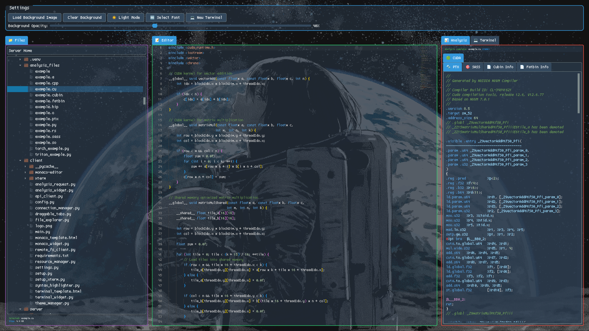

# An IDE for Micro-Optimization

<figure style="text-align: center;">

<figcaption>A screenshot of what I've got so far.</figcaption>
</figure>

 

It's now popular concensus that LLM developer tools are not going anywhere, and will only become more prevalent. Like it or not, there is no going back. We live in a changed world. Resistance is futile.

So it makes sense to learn the latest tools, and build new ones. I have some ideas on how to build new ones, which I will lay out here. I don't see anyone doing this, so I will do it myself.

 

## Agentic Features vs Tab Complete

    I started off as I believe everyone else did. Go to an LLM provider's website, usually Claude 4 or Deepseek V3 or R1 nowadays, and copy/paste the relevant code in and out. If you need multiple rounds of revisions, keep copy/pasting. It's not ergonomic, but this works pretty well. Until your application gets too big.

    I learned Cursor a while ago. It was alright. I didn't actually get much out of the tab complete feature, but the agentic features were actually really good. Tell it what to do, and it does it. If the LLM makes a mistake, ask it to fix it. Pretty good.

Then I found 

    But I found that Cursor doesn't do some things that I was interested in. It's packaged terribly on Linux, and a bunch of functionality is broken or causes the IDE to go unresponsive then segfault. I've never heard about anybody else with this issue, but it was a huge issue for me. Cursor seems just... not stable. I'm using an old version before the version that introduced the crashes. And with the UI changes that they made I never got to feel as comfortable in Cursor as vanilla VSCode or VSCodium.

Then I tried Windsurf. It seemed like Cursor but slower and kinda worse. And yet again, I didn't get a lot of use out of the tab complete features. The agentic features were the good ones. It's really nice to send it off to fix something, do something else, check the changes it made, run a test, and then tell it to do another thing, go do something else, rinse and repeat.

Tab complete 

Enter [Aider](https://aider.chat/).

So for a while, I've been rolling with VSCode. It's pretty good. I have no complaints. I could use Windsurf, but and Aider.

