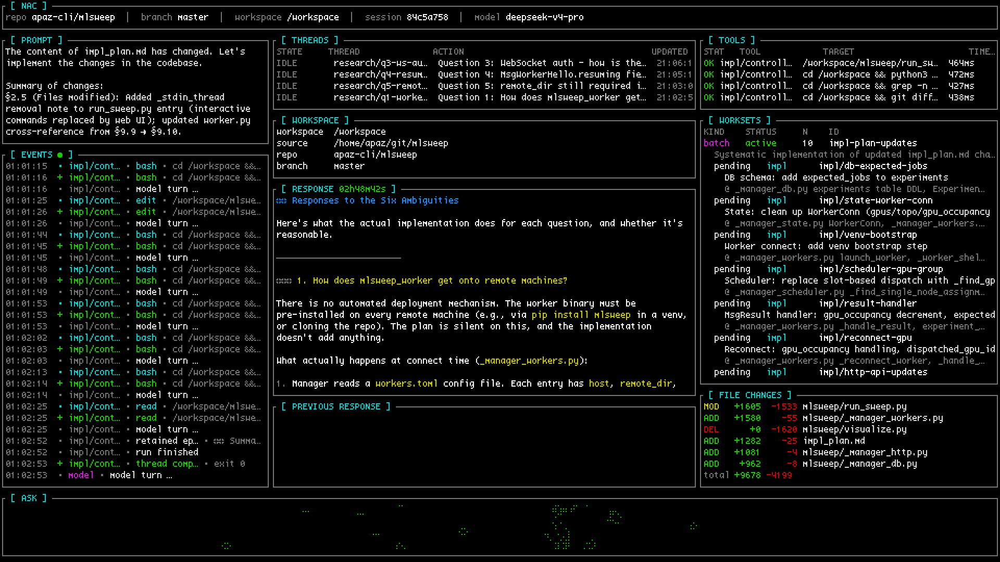
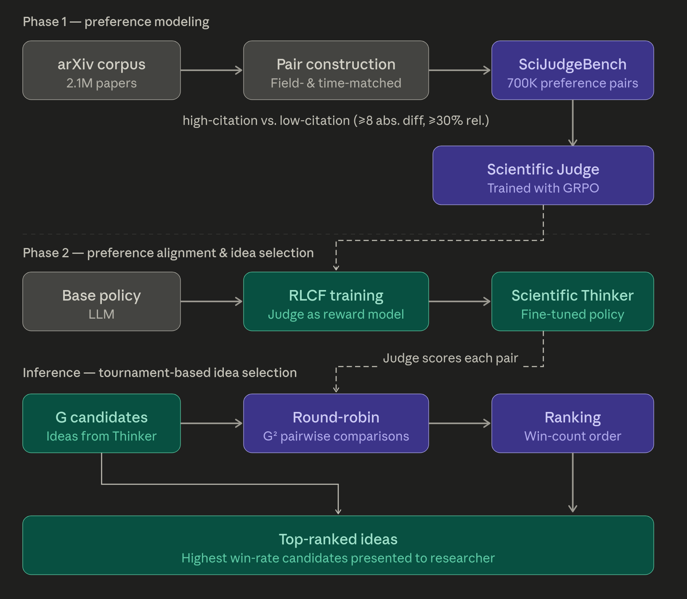
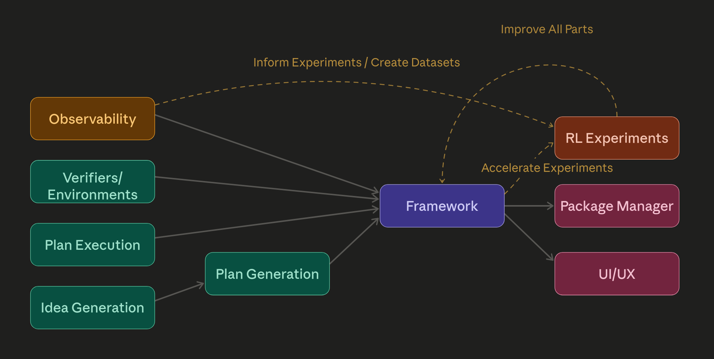

# My Current Research Direction

Here's an attempt to explain my current research direction. A manifesto, some thoughts and experiment ideas, and a roadmap of sorts.

## A Utopian Vision

I think that automated optimization and discovery, and perhaps automation in general, is one of the highest leverage areas one can work in. If not the highest leverage, 
definitionally. I've thought about it a lot.

Long term, what I want is a cure for cancer. I want to understand myself and live forever. Ship of Theseus my brain onto a server rack and live in cyberspace. That sort of stuff. The cool stuff.

But I also have no idea where to start if I were to try to do this directly. I have no chance of curing cancer. I don't know what KRAS mutations or mTOR signaling pathways are. Nor do 
I think it's worth it for me to try to learn. I could, I know I am good at learning, but it would take too much time, and there are other potentially more productive things I could be 
doing.

If I'm to contribute to human flourishing, clearly the answer is automating research. Or rather, to reverse the script, if human flourishing is to happen, clearly research needs to be 
automated. There are not enough person-hours to accomplish all that needs to be done otherwise. And now that we've got good LLMs I see nothing but opportunity.

 

<figure>

<figcaption aria-hidden="true">There are no holes in my logic whatsoever. Truly, my views must be unassailable.</figcaption>
</figure>

 

### General automation

I have no evidence of this, but I would be surprised if automating machine learning research were not at all applicable to automating other kinds of research. If you can build a 
system that can do one kind of research, why can't you build one that can do other kinds or all kinds? I am fairly certain, furthermore, that improvements in machine learning models 
and the surrounding systems will have compounding gains.

This is coming very very soon. Not within our lifetimes, probably within the next year. The path is clear, and things will only accelerate from here. It may be a little while longer before the normies start to notice, but they will notice.

A world with Recursive Self-Improvement is upon us soon. Until we hit some sort of wall. But before we do the world will be in one way or another a fundamentally different place. Hopefully a better one.

Day to day though, I'm not thinking so much about this. I'm thinking more about how to keep my GPUs warm.

## Keeping GPUs Warm

GPUs sitting idle is bad. I'm very optimization-brained. I don't want to deploy something that isn't within an order of magnitude of as efficient as it can be, but honestly in this 
case it doesn't matter. GPUs doing something is waaaaay better than GPUs doing nothing. Running your GPU at 1/10th the efficiency is probably still worth it, the hard part is figuring 
out how to get them to do useful work over longer periods of time. So, What do you do with them?

### Traditional Answers (boring, zzzzzz, honk shuuuu, mimimi...)

Currently, to extract continual value from GPUs you have three options.

1. Become a neocloud
2. Become an inference provider
3. Become a dataset vendor

These are tried and tested business models. But... that's the thing. They're whole businesses. In industries that are generally won on trust and scale. Too much commitment. Not for me.

### The Cool Answer

So, unless you want to commit to becoming a hyperscalar of some sort, not really an option for most, you're going to have to do something else. Ideally something reasonably 
high-value. The most impactful thing you can do, it turns out, is automate stuff you were already going to do. And then go do something else.

As software engineers, there is a really obvious first problem to work on. We all have projects that we don't have enough time for. Get the GPUs to do those projects. Generate code. 
Automate software engineering. Or at least outsource to them whatever you can.

The first version of automation that I built is a very simple queue of prompts. I often go to bed after I've used up my Claude credits, and then get up and start again. But there's 
typically a 5 hour window where I miss out on my limits. What do I do? I maintain a folder with prompts I need to run and then `sleep ... && claude -p "Hey go do this thing"` for each 
of my accounts, after checking when the limits renew.

 

<figure>

<figcaption aria-hidden="true">In my hour of need, Claude left me. I've never felt so betrayed.</figcaption>
</figure>

 

I still think that this is a decent mode of interaction. Maybe it could be automated a bit more. A human maintaining a list of things that need to be done and making sure they are 
done to their liking is going to be an important part of the future stack. There is a bandwidth bottleneck between human and model, and we can't forget that expressing intent is an 
important part of automation. Better forms of interaction will follow in the future. Clearly this is not its final form.

This has been good for squeezing a bit more usage out, but clearly the final form is something that you can host which consumes as many tokens as possible, concurrently.

What we really want is to squeeze a GPU for all it's worth, and consume as many tokens as possible, 24/7, and always be working on something.

Why did I set up automation with Claude instead of running the model myself? Until recently, open models have not been good enough. This has changed, I think, with the release of 
Deepseek V4 and possibly MiMo V2.5. Kimi K2.5 is decent, but my attempts to use it for tasks requiring long coherence have been lackluster. It's only now with V4 that I think we have 
a truly good model. I've yet to test MiMo as extensively, but they benchmaxxed it for very hard SWE tasks, so it may be interesting. Anyway. Now that we have at least one good model, 
which we can sample craptons of tokens from while people are sleeping, we can get to work.

For the last few days, [@nyxkrage](https://x.com/nyxkrage) and I have been using [@stochasticchasm](https://x.com/stochasticchasm)'s vibe-coded agent harness, 
[NAC](https://github.com/sapiosaturn/nac). With V4, it's much better than you would get out of Claude code or codex at very long-running long-coherence parallelizable tasks. It's 
still in early stages and can still use some work. There's a twitter group chat where we're adding features, fixing it up, and doing a bit more context engineering. But this is the 
first time where I've felt like arbitrarily-complicated large code changes are possible within a ~1M context window. I can drop a 3000 line plan file in there, and it doesn't choke 
and compact itself to death. Crazy. We can finally do complicated features and refactors.

 

<figure>

<figcaption aria-hidden="true">NAC in action</figcaption>
</figure>

 

The part relevant to how NAC solves long-horizon coherence is [here](https://github.com/sapiosaturn/nac/blob/main/crates/nac/src/agent.rs#L60-L156).

## Closing The Autoresearch Loop

In the past few days, open source has made huge strides in automatable SWE coding. The capability to execute on plans is huge.

But wouldn't it be cool if we were also very good at a couple other things? If we put together idea generation with generating a plan from that idea, together with executing on that plan, together with verifying the results... we get Autoresearch. That is an Autoresearch loop. Let's talk about the other parts and applications.

## Idea Generation

I have opinions about this. Luckily, fairly-easily-validated ones. Of particular interest has been the [AI Can Learn Scientific Taste](https://arxiv.org/abs/2603.14473) paper.

 

<figure>

<figcaption aria-hidden="true">A quick explanation of what they did for the paper</figcaption>
</figure>

 

I think citation count is probably not the best metric for judging idea quality. Judging ideas contrastively against each other is probably better. I would be willing to bet that it 
generalizes better than doing RL on noisy labels. But also, n^2 comparisons is a lot. It would also be nice to find a comparison method that does not require this, where we can set a 
cap of how many comparisons we want to do, and estimate from there.

As a playground for these ideas, I wrote [archivore](https://github.com/apaz-cli/archivore/). The idea is to download every machine learning paper off of arxiv, and squeeze new 
research ideas from them. I ran it overnight for a while and it discovered some good stuff. Some of the ideas were nonsensical, but some of them were pretty decent.

I would like to draw attention to [this file](https://github.com/apaz-cli/archivore/blob/master/archivore_ideate/archivore_ideate/quality.py#L61-L120), particularly the 
`rank_by_impact()` function. It turns out that there are more efficient ways to rank ideas than full round robin. In particular, you can set a cap and sample randomly from the n^2 
search space to extract a [Borda count](https://arxiv.org/abs/1512.08949). This turns out to be provably optimal, at least in the regime where you can't extract information about 
where in the space to sample based on previous results. This works well if n^2 is less than your batch size.

But, suppose n^2 is far greater than your search space. you can sample based on previous results. This looks more like bayesian search. The technique for this, I have learned, is called Bradley-Terry-Luce ranking. This becomes more optimal, and is cheaper to compute and handles concurrency better than something like borda score. Which is a different technique.

When I tried this, it did appear to select for the better ideas than estimated citations. I did the filtering with Claude Sonnet 4.6, which already seems to have decent research taste. 
Haven't tried V4 yet.

The next step here would be to do RL. Replicate their paper with a new metric. I still think that Borda count would result in a cleaner reward than relying on citations. I've not done this experiment yet, but now that I've got V4 I might get around to it eventually. Benchmark it versus the model they released, and see what happens.

Truly an inspiring paper. I have a lot of ideas on how to scale idea generation.

## Verification, Verifiers, and Community

Currently, [verifiers](https://github.com/primeintellect-ai/verifiers) is the open standard for verification. At Prime Intellect we talked a lot about environment design, and how to design APIs that support whatever weird nonsense you're trying to do. How should the environment communicate causal masking. How about fine-grained rewards? We thought a lot about these things, and delivered two packages that resolve all of these footguns, verifiers and [prime-rl](https://github.com/PrimeIntellect-ai/prime-rl).

I don't have much to say here. Verifiers is good. It is optimal.

Although, actually, I do have something to say. The community aspect. What a great idea! Getting LLMs to write verification code is hard. Reward hacking is still a problem. You're going to want some sort of package manager. Build a community, and let the community solve the problem.

Verifiers? Hah. Autoresearchers. Write a framework that lets you run things super easily and efficiently and handles all the footguns. Then let people publish their code as a package, so you can just clone or pip install it.

This is what I've been working on with [autoresearch_anything](https://github.com/apaz-cli/autoresearch_anything). The goal is that the user just implements an `Autoresearcher` class, and the framework takes care of everything else. All the concurrency and communication and observability and infra and pipelining to overlap training and testing to keep warm every GPU involved. This achieves much better utilization and concurrency than if you were to just run everything locally through an existing agent harness. I think, such a framework is clearly the path forward in the medium term.

I also wrote a bit about open source community a year or two ago, see [The Competition For Contributors](https://apaz.dev/blog/The_Contributor_Competition.html). It is relevant, I think.

## Higher-Order Autoresearching

One thing that verifiers tried and kinda-failed at was getting AI to generate full environments. It is hard to get LLMs to generate environments that are not hackable.

This sort of thing has been [done before by Moonshot for Kimi K2](https://www.dbreunig.com/2025/07/30/how-kimi-was-post-trained-for-tool-use.html) and most assuredly other people to great effect. They generate a whole ton of tools and environments, then apply heavy filtering. Then they put them into synthetic RL environments and simulate multiturn trajectories. Which they then filter heavily again. The Kimi tool/env generation story is mostly about filtering. It is most certainly possible to do RL on this, and it is possible to do the same thing with Autoresearcher classes.

I also have a hunch that observability tools are going to be important. The thing about these multi-agent systems is that they go wrong in unexpected ways. LLMs have a tendency of breaking on you when you don't prompt them super carefully. It would be really nice if the framework itself could help you diagnose breakages and improve your Autoresearcher. Thousands of traces are too long to read manually, LLMs have the potential to speed this up significantly and allow you to find things you otherwise couldn't. Really, you could apply the system to itself. Look at the data, generate ideas about how it's breaking and how to improve it, filter them, and present them to the user. Autoresearching autoresearch.

 

<figure>

<figcaption aria-hidden="true">How it feels to Autoresearch Autoresearch</figcaption>
</figure>

 

This is for once things work though. Let's not get ahead of ourselves.

## A Side Note
As a side effect of these capabilities being generalizable, they can absolutely be used for evil in the near future. V4 may not be "Mythos-level," but there's a high likelihood that you can find all sorts of dangerous bugs this way, for incredibly cheap. I think the only reason that existing models have not led to a stream of CVEs is that no suitable harness exists yet. Someone is probably building one. I don't know why more people aren't freaking out right now.

## Roadmap

So, in conclusion. These are the things that I think need to be built or improved.

 

<figure>

<figcaption aria-hidden="true">How a general Autoresearch framework would fit together.</figcaption>
</figure>

 

If all of these things get built, in some order, I think the world changes in a meaningful way.

Your roadmap probably looks like something different. But really, and movement in this direction is positive. I hope you enjoyed my idea dump. I'm interested in yours.
