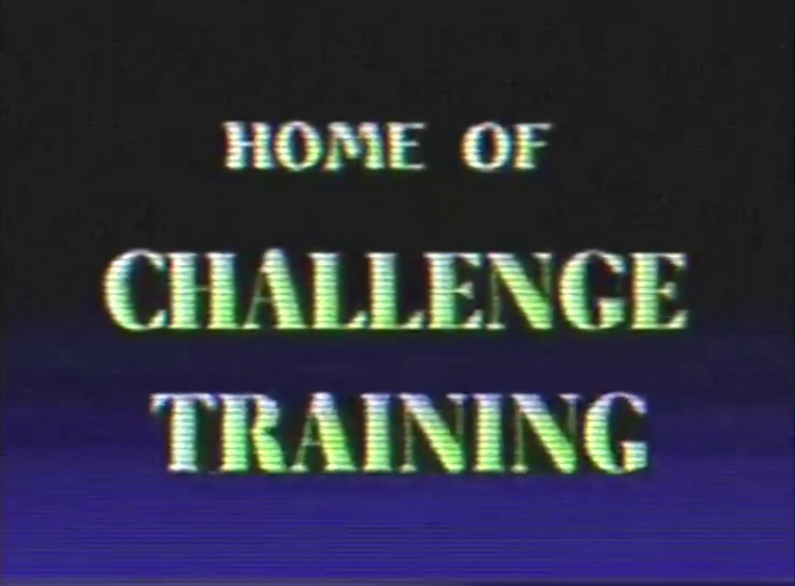

# Scaling Agents to Unfathomable Depth and Context With Zeroth-Order Optimization

<br>

An interesting research direction I'm thinking about. Posts like this are often ignored because they are not directly applicable to anyone's work. But this might be a new scaling paradigm. So I've sort of dropped everything to work on it, study it, understand it. This is a writeup of some things I've learned.

This is a long one. I apologize that I did not have time to write a shorter article. But it's written so you can skip around a bit.

Part blog post, part math dump, part research notes and idea vomit. Many of these ideas should be papers. At some point they might be. I'm also releasing a training codebase called ZOTitan, a kernel autoresearch codebase, and some example kernels and recipes. Hope you enjoy.

<br>


<br>


## Optimal Architecture

There is a search space of potential architectures, and from them you are limited to architectures which you can actually train. If you cannot train a model, you cannot evaluate it. Better architectures undoubtedly exist, but how are we to know if we can't train them?

Transformers are great. They're rather stable. You can backprop through them very easily. They train fast, and prefill is parallelizable which allows for computing dense rewards efficiently. Most importantly, transformers scale. You dump an amount of data into it, and it soaks it up at a predictable rate. This is very practical and great. But it's also true that attention is not perfect. Most famously, attention is `O(n^2)` in context length, and transformers are not [recurrence-complete](https://arxiv.org/pdf/2510.06828). That is to say, the forward pass of a transformer cannot actually express any function of its inputs, as it has a finite amount of layers. This is potentially a problem because as context accumulates, so does the amount of potentially-intermingled state that has to be tracked in a limited number of layers.

This seems not to be such a big problem in practice. But can we really say that? How sure are we? We may be in the early stages of hitting context scaling limits we're not aware of. It's not clear that efficient attention variants can scale cleanly to truly massive contexts in the limit. It might be that you just run out of depth. Our best transformers place a lower bound on the context scaling limit, but we have no real way of knowing the upper bound, as we cannot run evals on hypothetical better models that do not exist.

On the other side of the spectrum, you have [RNNs and LSTMs](https://arxiv.org/pdf/1808.03314). Or, architectures with recurrence more generally. While a default transformer is incapable of expressing a function with more discrete decision points than the sum of its layers, a [looped transformer](https://arxiv.org/abs/2510.25741) actually can because it has "infinite layers" through recurrence. The downside is that to train it you need a gradient through infinite layers also. This is mathematically sound, but numerically unstable. Due to the catastrophic accumulation of small rounding errors, you cannot backprop through infinite layers and get the right answer at the end.

But what if we didn't do backprop? What if there were a way to train these architectures that would be otherwise impractical, like RNNs or even something non-differentiable? Once you start relaxing enough restrictions, maybe there's an architecture out there that's better for long context in the limit. It's certainly possible. In fact I think it's almost certain. Most long-context memory systems you'd want to design are nondifferentiable. There's no way to train them. Until now, potentially.

Really though, who knows what the optimal architecture will be. Maybe it looks like a transformer, maybe it looks more like an RNN, maybe it's sparse, maybe an MoE, maybe it's a weird diffusion thing, maybe [Mamba](https://arxiv.org/abs/2312.00752). Maybe it's RWKV's [ROSA](https://arxiv.org/abs/2602.02499). Maybe it's something exotic that nobody has come up with yet. Or a combination of all of the above. But it's out there.

My concrete fear is that we are barking up the wrong tree. Considering how many people have put effort into solving the transformer context length scaling problem, I don't think such a thing as free lunch exists if we keep doing what we're doing. If it did, someone would have found it by now. I think the efficient sparse attention techniques we already have are close to as good as they're going to get.

This is not to say that scaling context length in transformers is not worth working on, there are very practical gains to be had. But I suspect that we'll only get like a single order of magnitude improvement over what already exists in OSS. Still a world-changing amount of performance left on the table, but not multiple orders of magnitude.

### Depth over Width

In any case, regardless of what the architecture looks like, I think there's one axis that it makes sense to scale on, and that's depth.

There is a very good paper called [The Impact of Depth on Compositional Generalization in Transformer Language Models](https://arxiv.org/html/2310.19956). They find that:

1. Depth helps compositional generalization, but with sharp diminishing returns.
2. Depth also helps language modeling loss, again with diminishing returns.
3. Deeper models generalize better, even after controlling for perplexity.

This would suggest that there's some sort of sweet spot in the number of layers. That makes a lot of sense. You need to have enough layers to do the task. This is essentially the recurrence-completeness argument in the paper linked above in the previous section. There are some tasks you can't do, until you have enough layers, and then you can do them.

The reason we don't scale to massive depth at the moment is that training dynamics get wacky. Even if vanishing or exploding gradients don't cause the run to diverge, numerical issues add noise to the grad update, slowing the training down. Worse, the noise might be biased. Yuck. Not good for convergence.

There's a sweet spot, a cutoff in the depth of the model that it makes sense to train. But it's hard to say causally what is going on. Are we hitting a wall because scaling depth is no longer useful for any problem we want to evaluate? Or is it because of training dynamics?

In any case, scaling depth seems to be [very important for long-context in-context learning](https://arxiv.org/pdf/2510.01098). Which is what agentic coding is dependent on, and the thing that we're trying to maximize as an industry. If we could train deeper models it might mean that agents can solve new problems that they weren't able to before, with higher reliability. So I would guess, despite the fact that scaling transformers with first-order optimizers continues to lead to improvements, that this is in fact a very prescient issue.

I think both reasons not to scale deeper are invalid. Training dynamics and infinite depth? That's a skill issue, just don't use backprop. Task saturation? Yes, scaling depth saturates on easy problems. But we don't care about easy problems, because they're already solved. We want to solve hard problems, and scaling context length naturally presents harder and harder tasks that require tracking more information and making more decisions in the process of producing each token.

So, let's find a way to scale deeper models to longer contexts. Zeroth Order Optimization, and in particular the branch of research derived from [MeZO](https://arxiv.org/abs/2305.17333) and [SPSA](https://www.jhuapl.edu/spsa/PDF-SPSA/Spall_TAC92.pdf) seems to me a practical approach to this because it does not require backprop and should work with any architecture, even non-differentiable ones.

That is, if we can get it to scale, which has of course never really been attempted on the level we're talking about here.

## Zeroth Order Optimization

A first-order optimizer uses the first derivative (the gradients) to optimize the objective. See SGD, SGD with momentum, Nesterov, Adam, [Muon](https://kellerjordan.github.io/posts/muon/), etc. All the stuff we use. A second-order optimizer uses the second derivative (the hessian). See Newton's method, and a few others. The hessian is intractable, as it's N by N in the parameter count. So nobody does this, although many optimizers use approximations of hessian information to do their job better. Adam does this with its second moment, for example.

But consider zeroth-order, an optimizer that only uses the parameters to optimize the parameters.

As it turns out, you can save a LOT of memory this way. You don't have to store intermediate activations or gradients. And much like RL, we can choose any loss function we want, because we're guessing and checking. It's amazing. Super easy to scale. Optimizes any objective. Genuinely fantastic.

Yet another cool thing, perhaps the coolest. Since there's no backwards pass, training and inference are the same thing. You can extract useful work from the model as you're training it, so long as you have metrics to measure your work by.

Let's explain how it works. To minimize the loss by tweaking model weights, you need direction information and magnitude information. You need the gradient, a vector in `p`-dimensional space. Which you don't have, so you have to find a way to estimate.

There are a bunch of ways to do this. Of particular interest to me are the algorithms that derive from [MeZO](https://arxiv.org/abs/2305.17333), [SPSA](https://www.jhuapl.edu/spsa/PDF-SPSA/Spall_TAC92.pdf), and [Evolution Strategies](https://arxiv.org/abs/1703.03864), a paper written by OpenAI in 2017, coauthered by Ilya Sutskever.

We all kinda forgot about this research. You may be wondering though. Why have I never heard of this?

### It sucks.

The common thing about to note about every Zeroth Order approach in this family of algorithms is that it sucks. And that's probably why nobody uses Zeroth-Order optimizers. I don't know much about other families of Zeroth-Order algorithms. Judging by the fact that I haven't heard anybody talking about them, I must conclude that they also suck. At least compared to the clean signal that backprop provides. Why mess with a good thing?

<!--
<br>
<div style="text-align: center;">
<figure>

<figcaption aria-hidden="true">Big Jeff's Zeroth-Order Hell</figcaption>
</figure>
</div>
<br>
-->

The specific reason why this algorithm family sucks is that the only way to get information about the true gradient is by sampling, but sampling doesn't give you a lot of information about the true gradient. The information it gives you is too noisy. The signal-to-noise ratio is awful. Worse, it's not noisy in the way your batch is noisy, it's noisy in a deeper, more fundamental way. To get a gradient update with the same amount of noise as you would get by doing backprop a single time, you need to average over `p` perturbations, where `p` is your parameter count.

We'll get to the math in a few sections, but in summary it's better just to obtain the true gradient using backprop if you have the option. Calculating it directly is much better than trying to estimate it with smoke and mirrors. Yet with that said it works, because enough randomized projected gradients are an unbiased estimator of the true gradient. You don't have to do backprop if you can tolerate the projection noise.

But why bother? Clearly nobody bothers. I'm bothering. Dangit. I got nerdsniped so fucking hard.

You would think this would be the end of the story for ZO-Optimization. But not quite. Unfortunately I think ZO has a lot of potential. And other people are starting to think so too.

## ZO Tricks

There are a number of interesting things that you can do. I think they make this class of techniques worth not completely counting out yet.

Some of these tricks exist in the literature. Many of them do not exist in the literature and I do not think anyone else has thought about them. They're original thoughts by me. Perhaps obvious ones, but original regardless.

### Evolution Strategies at Scale / EGGROLL

Semi-recently, some very notable papers came out. They changed everything.

The first one is [Evolution Strategies at Scale](https://arxiv.org/abs/2509.24372). It was shocking because it overturned the assumption that Evolution Strategies cannot scale to billions of parameters. When OpenAI tried it in 2017, they used millions of parameters, not billions. They did it on a cluster of CPUs. By 2019, there was widespread concensus and a [paper](https://arxiv.org/abs/1901.11503) saying that, for theoretical reasons, it wouldn't work. When asked, [even Ilya said it wouldn't work](https://youtu.be/9EN_HoEk3KY?si=oD8NFUOsI_GM9AuQ&t=3210).

To be fair, it's easy to see why everyone thought this. The signal-to-noise ratio gets worse the more parameters you add, whereas in traditional first-order pretraining and RL it does not. This is mathematical Truth, with a capital T.

Counterpoint. Just try it. What if it works?

OpenAI trained a model with millions of parameters, with a population of 30,000 perturbations to the model every step. The [ES at Scale](https://arxiv.org/abs/2509.24372) paper finetuned an 8 billion parameter model using a population size of only 30. And it beat PPO and GRPO. They didn't even have to tune it. This is a breakthrough.

The breakthrough is not really adequately explained until the [Neural Thickets](https://arxiv.org/abs/2603.12228) paper, which I have run out of time to explain, but you should definitely read because it explains how it's possible. From one of the authors' tweets, "Simply adding Gaussian noise to LLMs (one step, no iterations, no learning rate, no gradients) and ensembling them can achieve performance comparable to or even better than standard GRPO/PPO on math reasoning, coding, writing, and chemistry tasks." The fact that this is possible is surprising, but says something about the dynamics of the loss, at least in posttraining settings. Many directions seem to improve the loss, not just one. And for some reason, the bigger your model the more likely it is for a random direction to be helpful.

Another paper, [Evolution Strategies at the Hyperscale](https://arxiv.org/abs/2511.16652), also known as EGGROLL, scaled ES up and made it more efficient. They decompose the individual weight perturbations, which makes it less expensive to compute, and apply some other tricks. Then they also trained an 8-bit RNN using Evolution Strategies. They too recognize that Zeroth-Order optimization allows for training architectures that are traditionally difficult to train with backprop.

It is a very exciting time to be alive.

### MeZO

The [MeZO paper](https://arxiv.org/abs/2305.17333), also known as "Fine-Tuning Language Models with Just Forward Passes" pre-dates the ES at Scale and EGGROLL papers by quite a bit. It was released in 2023, and I think it should have set off more alarm bells than it did. It is amazing to me that so much work has been built on top of it, without said alarm bells going off, and without anybody taking a really close look at the implications of the math. I will do so in later sections.

The techniques described in the MeZO paper are why I think any of this is even tractable or interesting at all. In fact, this paper was the thing that nerdsniped me in the first place. I did not learn about ES at scale or EGGROLL until later. MeZO does not introduce any particularly new concepts. Instead of adding to ES, it takes almost everything away and shows that it still works. It's more of an engineering paper, and yet another in a long line of "Wait, why does this work?"

In MeZO, the update rule is based on:
```
First, calculate a pseudogradient:

proj_grad = (L(Φ(θ + εz, b)) - L(Φ(θ - εz, b))) / 2ε

Then, apply it, with a learning rate:

θₜ₊₁      = θₜ − α · proj_grad · z

For some scalar loss function L,
some model architecture Φ,
the current model weights θ,
a batch of inputs b,
a gaussian distribution z (sampled every step)
a small scalar hparam ε (usually 1e^-3),
and a learning rate α.
```

This is essentially a drastically simplified version of Evolution Strategies, where the population size is one. ES came first, but I think the logical way to learn them is to understand MeZO first, and then add the ES tricks on top of it. I will be talking about the math that follows from the equations above for much of the rest of this article.

It is sort of shocking that this works. How can a population size of one be tractable? It should have set off alarm bells to question the assumptions previously made about Evolution Strategies. But in any case, it didn't. Nobody really understood the implications, and we all kinda just moved on.

Anyway. The core idea introduced in the MeZO paper is actually not that it works. It's in how you compute it. When you're doing this sort of training you don't have to actually *store* each perturbation to the model. That is to say, you never have to materialize `θ + εz` in memory. Reminder, `θ` is your model, `ε` is a small scalar, and you never have to store `z`. Implemented naively, you would have many copies of your model, or effectively many copies, as `z` is also model-sized. This is what OpenAI did, and it led them to scale it across a massive computing cluster, where each CPU would get its own copy of `z`.

We do not have to do that. For one, because MeZO does not have multiple `z`s. If we write our kernels very carefully, all we have to store is the seed to generate a model perturbation, and the activations of ONLY your current layer. Consider a single layer. Since ZO-optimization is perfectly-decomposable layerwise, we don't have to worry about anything else. This makes the memory cost extremely cheap. We need a buffer for the activations flowing into the layer. Depending on the layer we might need a buffer for the output if we can't reuse the input buffer. We'll also need to store the model parameters.

But that's it. That's all the memory you need, besides the scalar seed required to produce `z`.

One benefit of these insane memory savings (not having to store grads or activations or weights from other layers) is that you can crank up your batch/population size and make your activations/model width gigantic. And with perfect pipeline parallel scaling there's basically no limit on how big you can make your model. You're probably not very memory bandwidth bound. Assuming you wrote and overlapped the PRNG part of the kernels well, the scaling limit you run into is raw FLOPs. And with successive hardware generations, FLOPs and memory capacity for storing activations are scaling faster than memory bandwidth.

That is to say, with each hardware generation, this method becomes more suited to that hardware. The ideal would be something like Cerebras probably. Something like the tinygrad exabox is also looking appealing. You don't need good interconnects. You can probably just physically connect your GPUs together in a line. Most likely, that's your bottleneck. A very good one to have.

It's also worth making a note about PRNGs. Some are stateful, for example [xorshift](https://en.wikipedia.org/wiki/Xorshift). Stateful means that to generate the one millionth number in the sequence you start from your seed and sample one million random numbers. That is not the type we want to use. A Counter-based pseudo-random number generator ([CBPRNG](https://en.wikipedia.org/wiki/Counter-based_random_number_generator)) does not have this problem. To get the one-millionth number you pass in your seed and the number one million, and you get your random numbers. Good examples of this are [Philox](https://www.thesalmons.org/john/random123/papers/random123sc11.pdf) and [Squares](https://arxiv.org/abs/2004.06278). You want a CBPRNG that's parallelizable and easy to integrate into a kernel, and these are both.

### LoRA

As you recall, the main reason ZO sucks is that since you are estimating the gradients you get more projection noise the more trainable parameters you have. And that's bad. Really bad.

Suppose, contrary to the findings of the [Neural Thickets](https://arxiv.org/abs/2603.12228) paper, that this is intractable and needs to be fixed. [LoRA](https://arxiv.org/abs/2106.09685) adapters do truly fix this problem, as they decrease the number of trainable parameters.

There are potential downsides to this. You would think that low-rank updates are not preferable to the more full-rank updates you'd get if you actually trained the whole thing. Although, more on that later. It's not clear that this is preferable.

I think LoRA in Reinforcement Learning is the closest analogue here. It's different, because it's exploration in policy space, rather than in parameter space like ZO. But in RL, it appears [not to be so bad](https://x.com/kalomaze/status/1964455970517753878). By continually merging LoRA adapters (via [ReLoRA](https://arxiv.org/abs/2307.05695) or similar) you can keep the model shifting, causing the next lora adapter to retarget different low rank changes. Across many updates, these low-rank changes sum to high-rank changes. So it is at least somewhat questionable how much this matters in practice.

But also note that it seems [not to work as well for smaller models](https://arxiv.org/abs/2509.12960), and also not as well at the beginning of training. Hence the ReLORA paper actually doesn't use adapters at the start of training, instead opting for full-rank updates at the start. This is a paper that tests for first-order, but it probably carries over.

But, it goes without saying that MeZO + LoRA (plus other stuff) is totally doable. All of these techniques I'm talking about can be combined. You can write fast kernels for them.

There's also another paper to look into called [LOZO](https://arxiv.org/abs/2410.07698) which takes the "MeZO + LoRA" idea further. [EGGROLL](https://arxiv.org/abs/2511.16652) is very similar. Essentially you can also LoRA your perturbations. Initially, this seems like a strange thing to do. But the LOZO paper justifies it by saying that, since gradient updates tend to be low rank anyway, maybe you actually *want* low rank perturbations. If the update is supposed to be low rank, if it isn't (if each parameter follows a gaussian like in MeZO) then it is poorly conditioned and the parts that aren't are actually noise. Or, if they're not, the high-rank parts are probably along flat directions, and you would get a better update on average and reduce your variance with a lower rank update.

I'm both sold and not sold on this justification. My intuition is that sparse updates are fine for narrow finetuning tasks. For harder stuff it's not clear to me that low rank updates are enough to reach the best-generalizing solution. So maybe ZO pretraining is dead in the water, maybe it isn't. It might work, it might not.

I think more research needs to be done here in general. There are still more basic questions to answer about what works and why.

### ZO Context Extension

Right now the most popular way to do Transformer context length extension is through [RoPE](https://arxiv.org/abs/2104.09864) scaling. You could also use [YaRN](https://arxiv.org/abs/2309.00071), or [NoPE](https://arxiv.org/abs/2305.19466), or any manner of other things. I don't really have many opinions here.

Whatever the strategy, people also frequently use LoRA to do this memory-efficiently. It can be hard to fit long context lengths to the hardware otherwise. This is our evidence that low-rank adaptations are sufficient for context length extension.

LoRA helps, but gradients are where all the memory is going. The main problem is that in first-order optimization of transformers, the size of your activations grows with the size of your context length, and you have to hold onto all of them until it's time to do backprop. This is also true of sparse attention techniques to varying degrees. No matter the architecture, there is an effective context size. And we can train it so we can track more state.

Zeroth-order optimization can operate in the realm of LoRA, and does not require you to store activations like first order. Seems like a match made in heaven. You can also do this context extension finetuning on actual tasks you care about while you're at it. Make sure it's not just effective in terms of perplexity loss, but also in practice on tasks. You can do simultaneous RL, if you want to.

### Converting an Existing Model for ZO

Since first-order optimization already works really well for pretraining, and ZO is useful for training models and tasks that are not differentiable, it makes sense to explore pretraining a model and then converting it to other architectures for cheaper inference and finetuning with ZO.

Papers that have stuck out to me along these lines are:

* [The Mamba in the Llama: Distilling and Accelerating Hybrid Models](https://arxiv.org/abs/2408.15237)
* [Transformers are RNNs: Fast Autoregressive Transformers with Linear Attention](https://arxiv.org/abs/2006.16236)
* [Pretraining Recurrent Networks without Recurrence](https://arxiv.org/abs/2606.06479)

And, most promising of them all, [RADLADS](https://arxiv.org/abs/2505.03005). They even released [training code](https://github.com/SmerkyG/GoldFinch-paper/tree/radlads), which is very awesome.

Optimizing ZO training means optimizing inference. And optimizing transformer inference tends to be really hard, because of kvcache management. For the sake of rapid experimentation it makes sense to train a model to act as a good base for experiments.

I don't think such a model exists yet. The closest is [RWKV](https://www.rwkv.com/). It would be cool to convert an existing large model, one stronger than RWKV, to something like an RNN.

It is my dream to make Deepseek V4 an RNN and finetune it with Evolution Strategies. The sooner that day can come the better, because it's almost a prerequisite for everything else I want to do. Obtaining a strong base to do further experimentation on is probably the highest priority.

This is a pretty hard problem though. Getting ZO to work for pretraining may actually be easier than this. I will have to stare at the model conversion problem for a long time. My preliminary idea is to try to do something like what I'm about to describe for removing skip connections, treating kvcache as RNN state and gradually training it into a different shape, but I'm not quite sure on the details yet.

### Removing Skip Connections

Skip connections. Pretrained off-the-shelf transformers have skip connections.

Each skip connection doubles the size of your intermediate activations. In FO they're not a problem, because you're storing all of those activations permanently anyway. Just store an extra reference to a tensor. There's no extra cost.

In ZO there is an extra cost, adding a skip connection means you can't free the previous activations and reclaim the memory. In practice this is not a problem, because in transformers the skip connections appear within blocks, not across blocks, and you're probably sharding per-block. But if for some reason in the future cross-block skips become stylish you would have to deal with this problem.

Anyway, I got thinking about this problem, despite it not really being a problem. Still, how can you rip skip connections out?

The first thing I tried was just ripping them out and re-training. Don't do this, it doesn't work. It catastrophically destroys the model, it's equivalent to retraining from scratch. I have two much better ideas now. Haven't gotten around to implementing them yet.

The first new idea is just to do continued pretraining. Freeze the residual weights, and decay them to zero according to a schedule. Probably you want to do a bit of warmup before touching them. Then the brain damage you're doing to the model by decaying the residuals gets healed over the course of training.

The second new idea is probably better. You can just add the sum of the residuals to your loss function, scaled by some factor. That factor can be how you can control the decay schedule. Maybe the brain damage is a bit more controlled this way, because the rates of decay individually are directionally correlated with the gradient. I suspect this to be important.

Many models don't have skip weights, they just add. That's fine. Pretend they do. Add skip weights, initialized to 1. Then train them out.

I've downloaded every paper off arxiv and done a search over them, and neither of these strategies have been written about. Skipless transformers are pretty niche (why other than ZO would anyone care?), and most papers about skipless transformers, for example [this one](https://arxiv.org/pdf/2510.00345) are about training from scratch. To my knowledge nobody has ripped the residuals out of an existing pretrained model.

But it's cool that there's a way to do it. It may require a little bit of finagling to get right, but it's almost certainly very doable.

### ZO RL

You can make both the model and the loss function whatever you want, as long as it's conditioned on the model weights. That means you can just optimize an objective directly. No tricks are required to get RL to work like in [REINFORCE](https://people.cs.umass.edu/~barto/courses/cs687/williams92simple.pdf) with the log-derivative trick. Not that the log-derivative trick is a problem. It's just cool that this works by default, without modification.

Multiple papers have been published where people do this, for example ["ES at Scale"](https://arxiv.org/pdf/2509.24372), but it would be nice to use this to actually try to push capabilities of models that people actually use. To actually push the envelope and do something that FO optimizers can't.

I also think about the results from ["Optimizers Qualitatively Alter Solutions And We Should Leverage This"](https://arxiv.org/pdf/2507.12224). What does using a ZO-posttrained model feel like? Better? Worse? It's worth a try.

Also worth pondering, is ZO RL more or less susceptible to diversity collapse? I would suspect less. The authors of some of these papers have stated in interviews that they suspect less also. In any case it's probably different in some qualitative way, and that makes it interesting.

### ZO and Momentum

In first-order optimizers, one frequently utilized technique is momentum. All the best optimizers have some concept of momentum. This has two beneficial properties. It accelerates convergence, and it also has the effect of smoothing over variance/noise. That sounds really really good, considering how bad the variance situation is with ZO.

"Let's add momentum to ZO" is not an original idea. Indeed, many papers have done this. Basically all of them actually, MeZO included. That's not so interesting. What's interesting is that you can do it without memory.

The strategy for implementing MeZO "the right way" is to never materialize `z`. This got me thinking. What if there's a way to do momentum without storing a momentum buffer? You could reproduce `z` from a sliding window over seeds, and use it to reconstruct the momentum. Well, yeah. It turns out the MeZO paper already did this. I ended up reproducing in my head exactly the same scheme they proposed. It's almost definitely possible to do super-low communication distributed training this way. Still, it's worth noting that this is possible.

I think the optimizer design space here is really interesting. It has fundamentally different properties compared to first-order, different things are optimal, but basically all the same tricks still work. I find it really interesting. We have to completely revisit the literature.

### ZO-Muon

Yeah, [this totally exists](https://arxiv.org/abs/2602.17155) and it also works. I think that's really cool. Nesterov momentum also works the way you want it to, as it does not depend on anything but your update, which is to say the pseudograd. You can just polar-orthogonalize your `z`, it turns out, and it gets scaled by the `proj_grad` and turns into the update. It's great.

A random thing that I've noticed as I've been doing experiments here. Both Muon and LOZO sample `z` differently, and create a `z` with different expected variance. If you don't renormalize, your choice of `z` distribution will inadvertently affect your choice of `ε`, potentially screwing your results. Polar orthogonalization gives you parameter perturbations with Frobenius norm `‖z‖²_F = r`, LOZO gives `mnr`, and standard Gaussian gives `mn`. Where `m` and `n` are the dimensions of the matrix, and `r` is the LoRA rank.

### Async Pipeline Parallelism Without Bubbles

Pipeline Parallelism has bubbles because of backprop. We do not do backprop, so we can saturate the interconnects with activations. Since layers can be updated independently, we can asynchronously send back seeds and projected gradient magnitudes to use to update the model everywhere all at once.

I'd like to drop a hint though that [MeZO-SVRG](https://arxiv.org/abs/2404.08080) probably has some interesting interplay with async pipeline parallelism and also distributed data parallelism methods like [DiLoCo](https://arxiv.org/abs/2311.08105). If you have to store a reference model anyway, you may as well use it to cancel some noise. Plenty of ideas for scaling here which have never been explored.

Also of course there are applications to hiding scoring latency, just like in async RL. Is ZO more or less tolerant to asynchronous updates than first-order async RL? Needs experiments.

### ZO MoE

I don't have any great ideas for this yet. At least nothing beyond what's present in the DSV4 paper, or any other MoE paper. It's worth noting though that:

1. ZO eliminates the need for differentiable routing (although it's unclear how much this matters)
2. Reducing the number of trainable parameters improves the noise estimate due to MeZO's gradient projection per sample
3. Reducing the number of samples that flow through a part of the model increases the noise estimate by dividing it by a smaller effective batch size.

Some kind of sparsity is probably optimal. This seems like a problem for later though. After other problems are solved. If anyone has any good non-differentiable routing ideas let me know, but the router being trainable is a feature rather than a bug IMO.

I think luckily this is probably a solved problem. But who knows, we'll see. Easy to say that when I haven't spent the requisite time slamming my head against it yet.

Writing the kernels for this is gonna SUCK. Normal MoE kernels are hard enough. Eventually I will have to do what I think everybody else does, which is stare at the [FlashMoE](https://github.com/osayamenja/FlashMoE) source, the [comet](https://arxiv.org/abs/2502.19811) paper, and Deepseek's [DeepEP](https://github.com/deepseek-ai/DeepEP) and [DeepGEMM](https://github.com/deepseek-ai/DeepGEMM) until everything finally starts making sense.

## MeZO Math

Here's a bunch of math. I've tried to make it readable, but if your eyes glaze over you can skip it if you like. It should be skimmable if you just read the parts that aren't in code blocks. Otherwise you can skip all of it or even better ask an LLM to give you the most important points.

In MeZO, the update rule is based on:
```
proj_grad = (L(Φ(θ + εz, b)) - 
             L(Φ(θ - εz, b))) 
             / 2ε

For some scalar loss function L,
some model architecture Φ,
the current model weights θ,
a batch of inputs b,
a gaussian distribution z (sampled every step)
and small scalar hparam ε (usually 1e^-3).
```

Assume for small `ε` (as MeZO does) that:
```
L(Φ(θ + εz, b)) ≈ L(Φ(θ,b)) + ∇L(Φ(θ,b)) · εz
L(Φ(θ - εz, b)) ≈ L(Φ(θ,b)) - ∇L(Φ(θ,b)) · εz
```

Plugging these into the update rule, we see that the losses and directions cancel out, leaving an expectation of the step size.
```
proj_grad = (L(Φ(θ + εz, b)) - L(Φ(θ - εz, b))) / 2ε
          ≈ ((L(Φ(θ,b)) + ∇L(Φ(θ,b)) · εz) - (L(Φ(θ,b)) - ∇L(Φ(θ,b)) · εz)) / 2ε
          = (L(Φ(θ,b)) + ∇L(Φ(θ,b)) · εz - L(Φ(θ,b)) + ∇L(Φ(θ,b)) · εz) / 2ε
          = (2 * ∇L(Φ(θ,b)) · εz) / 2ε
          = ∇L(Φ(θ,b)) · z
```

But when we take the step, we can see the problem. The `proj_grad` is a scalar, the direction to travel in `z`. Let's look at the update vector for taking a step.
```
grad_est  = proj_grad * z
grad_est  = (∇L(Φ(θ,b)) · z) * z
```

This does NOT bode well for the signal-to-noise ratio. It's not gaussian distributed, there are two gaussians in that answer.

But this does let us determine whether the gradient estimate is unbiased, which it is. That's good.
```
E[grad_est] = E[(∇L(Φ(θ,b)) · z) * z]
            = E[(z zᵀ) ∇L(Φ(θ,b))]      (since (∇L · z) * z = (z zᵀ) ∇L)
            = E[z zᵀ] * ∇L(Φ(θ,b))      (∇L is constant over z, pull it out)
            = I * ∇L(Φ(θ,b))            (E[z zᵀ] = I for z ~ N(0,I))
            = ∇L(Φ(θ,b))
```

Now let's derive the signal to noise ratio (SNR).
```
Recall that:
grad_est = (∇L(Φ(θ,b)) · z) * z
so
||grad_est||² = (∇L(Φ(θ,b)) · z)² * ||z||²

Take expectation over z
E[||grad_est||²] ≈ E[(∇L(Φ(θ,b)) · z)²] * E[||z||²]
                 = ||∇L(Φ(θ,b))||² * E[||z||²]

So,
E[||grad_est||²] = ||∇L(Φ(θ,b))||² * p
where p is the dimensionality of z, because z is a unit gaussian.

Our signal is:
E[grad_est] = ∇L(Φ(θ,b)), so
||E[grad_est]||² = ||∇L(Φ(θ,b))||²

Our noise is:
E[||grad_est||²] ≈ p * ||∇L(Φ(θ,b))||²

Therefore, our signal-to-noise ratio is:

SNR ≈ ||E[grad_est]||² / E[||grad_est||²]
    = ||∇L(Φ(θ,b))||² / (p * ||∇L(Φ(θ,b))||²)
    = 1/p
```

A SNR of `1/p` is not ideal. Pretty terrible actually. But whatever. It still beats trying to backprop through infinite layers.

Now, let's decompose the variance of the projected gradient. The `proj_grad = ∇L(Φ(θ,b)) · z` is a function of the random variable `b` (the batch). To get the variance, how much does the projected gradient vary as `b` varies?

Well, `z` is a gaussian random variable, so apply the law of total variance:
```
Var(X) = E[Var(X|Y)] + Var(E[X|Y])

Var(proj_grad) = E[Var(proj_grad | b)] + Var(E[proj_grad | b])
where E[] means "in expectation over infinite random samples."

But Var(E[proj_grad | b]) = 0, since E[∇L(Φ(θ,b)) · z] = 0.
Substitute in known gaussian variance for the remaining term:

Var(proj_grad) = E[||∇L(Φ(θ,b))||²]
Var(proj_grad) = ∇L(Φ(θ,b))²
```

That is to say, it depends on your network, your loss function, and the contents of your batch. Cool. The formula for first-order happens to be the same:
```
Var(grad) = ∇L(Φ(θ,b))²
```

But there's a catch. Our math up until this point assumes that the batch `b` is one inseparable item. But `b` is made of `B` entries. Then we have the identity:
```
∇L(Φ(θ,b)) = (1/B) Σᵢ ∇L(Φ(θ,xᵢ))
where xᵢ is the ith entry in the batch
```

For the variance of FO, we can simply divide by B. But the ZO case is much worse.
```
Recall Var(proj_grad) = ∇L(Φ(θ,b))² = E[||∇L(Φ(θ,b))||²].

Taking expectation over b, use the vector identity E[||v||²] = ||E[v]||² + E[||v -E[v]||²].

Var(proj_grad)       =
E[||∇L(Φ(θ,b))||²]   = ||E[∇L(Φ(θ,b))]||² + E[||∇L(Φ(θ,b)) - E[∇L(Φ(θ,b))]||²]
                     = ∇L(Φ(θ))² + Var(∇L(Φ(θ,b))) (Where I denote the true gradient without expectation over b as Φ(θ))

Then split up the batch by variance
Var(proj_grad)       = ∇L(Φ(θ))² + Var(∇L(Φ(θ,b)))
                     = ∇L(Φ(θ))² + Var((1/B) Σᵢ ∇L(Φ(θ,xᵢ)))     (by definition of batch gradient and i.i.d.)
                     = ∇L(Φ(θ))² + (1/B²) Σᵢ Var(∇L(Φ(θ,xᵢ)))    (because Var(c * X) = c² * Var(X) for any scalar constant c)
                     = ∇L(Φ(θ))² + (1/B²) * B * ∇L(Φ(θ,xᵢ))²     (because xᵢ are i.i.d.)
                     = ∇L(Φ(θ))² + ∇L(Φ(θ,xᵢ))² / B
```

In other words, the variance of our projected gradient has two components to it. There is direction sampling variance `∇L(Φ(θ))²`, and data variance, `∇L(Φ(θ,xᵢ))² / B`. The batch variance is reducible, whereas the projection variance is not. Every time we sample a gaussian `z`, it points in a direction. This direction is truly uncorrelated with the direction of the true gradient, it's literally a random gaussian.

If you want to fix this, you can't just increase the batch size. You have to do something else. Which we'll get to.

I think [MeZO-SVRG](https://arxiv.org/abs/2404.08080) is very interesting in this regard too, although I haven't gotten around yet to reading the paper or trying to combine it with other methods.

### Multi-z MeZO, SPSA

Speaking of multiple `z`s. Let's look into what that means for the variance math. We just derived that the variance of the projected gradient under MeZO is:
```
Var(proj_grad) = ∇L(Φ(θ))² + ∇L(Φ(θ,xᵢ))² / B
```

The `∇L(Φ(θ))²` is not divided by `B` because we are sampling only one `z` direction. It's a projected gradient, not a gradient.

What if we sampled multiple `z` directions? Suppose we sample `Z` independent `z` gaussians, with batch size `B` each. Then the expectation of `grad_est` (rename to `grad_est` as it is now an average of multiple directions and not just one projection) would be:
```
grad_est = (1/Z) Σⱼ ∇L(Φ(θ,bⱼ)) · zⱼ
```

Then calculate the new `Var(grad_est)`:
```
Var(grad_est) = Var((1/Z) Σⱼ ∇L(Φ(θ,bⱼ)) · zⱼ)
              = (1/Z²) * Z * Var(∇L(Φ(θ,b)) · z)        (By Bienaymé's identity because terms i.i.d. in j)
              = (1/Z) * Var(∇L(Φ(θ,b)) · z)
              = (1/Z) * E[||∇L(Φ(θ,b))||²]              (from single-z proof)
              = (1/Z) * (∇L(Φ(θ))² + ∇L(Φ(θ,xᵢ))² / B)  (from single-z proof)
              = ∇L(Φ(θ))² / Z + ∇L(Φ(θ,xᵢ))² / ZB
```

This is great news. Generating a new `z` for every batch improves the noise estimate linearly. In fact, increasing `B` is pointless because you could always just scale `Z` instead. If we are not storing `z` but regenerating it on the fly, then there is no added cost. This is a better axis to scale on.

It turns out that this algorithm is just a more general case of n-SPSA. It is also connected to [Evolution Strategies](https://arxiv.org/abs/1703.03864). The math for both of these work out similarly. Scaling the number of `z`s you're sampling from divides the variance.

So basically, there are better, more scalable ways to do zeroth-order optimization. And indeed, some people [have scaled this](https://arxiv.org/abs/2509.24372) recently, and found good results. They finetuned 8B Llama3.1 and Qwen2.5 models, and managed to beat PPO and GRPO on a basic RL task. I find this very exciting. The task now is to scale this up further.

I think the reason why ES and SPSA are underexplored is that it absolutely sucks to do in pytorch "the right way". They are way more expensive to compute if you actually have to materialize all those `z` vectors. So it's better to do it "the right way" and write kernels.

An interesting finding from the MeZO paper though is that somehow it doesn't matter so much if you don't do SPSA. One direction is mostly enough, because the gradient is low rank anyway, and there's a solid chance your projected `z` intersects it in some way and extracts signal.

If fairly vanilla MeZO, SPSA, ES, or similar works at the scales we care about, this might be a big deal. In any case I've not seen SPSA-Adam or SPSA-Muon tried, and certainly not scaled. Seems worth trying and deriving scaling laws for. More exploration needed.

### Derivations for Evolution Strategies

With all that out of the way we can finally put everything together and start talking about Evolution Strategies.

MeZO approximates a derivative by dividing a small difference by a small `ε`. It must be small because MeZO is based on a Taylor expansion. Evolution Strategies does not do this. Instead of the Taylor expansion, it uses a different heuristic, gaussian smoothing.

Let's define the ES objective `J` by convolving `L` with a normal of width `σ`. This is a hyperparameter like MeZO's `ε`, although we find in the end that the math is more forgiving. Like with MeZO, let `z ~ N(0,I)`. Which is to say, each element corresponding to each parameter is an independent standard normal corresponding to one parameter.

```
J(θ) = E[L(Φ(θ + σz, b))]
```

We want `∇J`. But we can't push `∇` through `L` if `L` is nondifferentiable or if we don't want to compute derivatives. But the Gaussian distribution has a property called Stein's Lemma. That is to say, for `z ~ N(0,I)`:

```
E[g(z) · z] = E[∇g(z)]
```

This holds for any `g` with polynomial growth. We make this assumption. Although we have no proof, it seems to hold in practice. Now set `g(z) = L(Φ(θ + σz, b))`. Then `∇g(z) = σ · ∇L(Φ(θ + σz, b))` by the chain rule.

```
E[L(Φ(θ + σz, b)) · z] = E[σ·∇L(Φ(θ + σz, b))]
and
E[L(Φ(θ + σz, b)) · z/σ] = E[∇L(Φ(θ + σz, b))]
```

We've made the right side `∇J(θ)`, the gradient of the smoothed objective. Therefore, 

```
∇J(θ) = E[L(Φ(θ + σz, b)) · z/σ]
```

This identity is exact for any `σ` and does not require the same `ε → 0` assumption. Instead, we can think of `σ` as an exploration radius hyperparameter, which is related to the learning rate.

Now let's look at the noise structure. No assumptions on `L` are required, we can assume that `J` is smooth by construction (via convolution).

So far we have derived for a single `z`, but recall that ES is a weighted average over a ton of `z`s.
```
grad_est = (1/Z) Σⱼ L(Φ(θ + σzⱼ, bⱼ)) · zⱼ / σ

where zⱼ ~ N(0,I) i.i.d. with dimensionality p,
and each bⱼ is an independent batch of size B.
```

Since (zⱼ, bⱼ) are i.i.d. across j, Bienaymé's identity gives:

```
Var(grad_est) = (1/Z) Var(g₁)
```

where `g₁ = L(Φ(θ + σz, b)) · z/σ` is the single-sample vector estimator. Now, let's apply the law of total variance, and derive the `Var(grad_est)` like before.

```
Var(g₁) = E[Var(g₁ | b)] + Var(E[g₁ | b])
```

On second thought, I'm... just going to skip over this part. I derived it all, and it turned into multiple pages of algebra, none of which is particularly interesting. It's kinda nontrivial, but your LLM will certainly be able to figure it out. 

Our final answer is:
```
Var(grad_est) = σ² · E[L(Φ(θ, b))²] / Z
              + ∇L(Φ(θ))² / Z
              + ∇L(Φ(θ,xᵢ))² / ZB
```

This is baseline noise, gradient noise, and data noise.

Let's compare this to the Multi-MeZO above.
```
Var(grad_est) = ∇L(Φ(θ))² / Z
              + ∇L(Φ(θ,xᵢ))² / ZB
```

You'll see that it's more. This is because base Evolution Strategies does not do [antithetic sampling](https://en.wikipedia.org/wiki/Antithetic_variates). That is to say, it does not evaluate `L` at both `θ + σz` and `θ − σz` for each `z`. But OpenAI do propose it in their paper, so let's consider that case also.

The estimator becomes:
```
Var(grad_est) = ∇L(Φ(θ))² / Z
              + ∇L(Φ(θ,xᵢ))² / ZB
              + O(σ²)
```

Where the O(σ²) term is a correction for the gradient smoothing. I have once again skipped over showing a bunch of work. The takeaway is that the smoothing replaces the true loss surface `L(θ)` with a blurred version `J(θ) = E[L(θ + σz)]`. Their gradients differ by the following formula:
```
∇J(θ) − ∇L(θ) = (σ²/2) · Δ∇L(Φ(θ)) + O(σ⁴)
```

Where `Δ∇L` is the componentwise Laplacian.

In this way, we see that the gaussian smoothing introduced by ES has tradeoffs. It biases the gradient updates for what is hopefully a more well behaved loss landscape. It pushes you away from sharp minima and towards flatter basins. Much like other flatness-regularized optimizers such as [SWA](https://arxiv.org/abs/1803.05407). What's cool is that ES gets this as a side effect of the variance reduction technique.

Again, I recommend chatting with an LLM about these things if you want to know more, as I just do not feel like typing it out.

But long story short, ES has the same `Z` vs `B` tradeoffs as MeZO does. The lessons learned from the MeZO math hold for ES.

### Triple Eval

Suppose, instead of sampling two locations `θ + εz` and `θ - εz`, you were instead to sample three, including `θ`. Doing this would get you information about the hessian. This information can be combined with the information you get from adaptive second moments. But that information is noisy. Skipping over a bunch of the math again, the SNR of your `v` estimate of the second moment is `Z/p`. So it is perhaps not so useful. The reason this was fine in modelspace was the [Neural Thickets](https://arxiv.org/abs/2603.12228) argument, which I don't think applies here. I think it is probably just bad. But still maybe worth trying. Maybe it does help. We've been wrong before.

I think the design space of possible optimizers is really interesting. The training dynamics of optimizing in model space are rather different, so perhaps the optimal optimizer is rather different also. We just have to try lots of things and find out.

## Codebase for Experiments

A couple months ago I wanted to test some of these theories I have, and figure out how to train these things. Ideas are worthless if you don't test and scale them.

I noticed though that there was not a good codebase. There does exist prior art. There is code for the [EGGROLL](https://github.com/ESHyperscale) and [ES at Scale](https://github.com/VsonicV/es-fine-tuning-paper) papers. The code is okay. They don't implement it "the right way," not that I blame them. The main problem I had was that I wanted to mix and match features from different papers to see how they interact, and they mostly focused on implementing their own paper. Fair enough. Kinda what you would expect out of a paper implementation.

I'm used to working in [prime-rl](https://github.com/PrimeIntellect-ai/prime-rl) and [torchtitan](https://github.com/pytorch/torchtitan). Nothing like this exists for Zeroth-Order Optimization. That's fine. Just gotta make it exist. Introducing [ZOTitan](https://github.com/apaz-cli/ZOTitan).

So far I have implemented:

1.  First-Order training (as baseline)
2.  [LoRA](https://arxiv.org/abs/2106.09685)/[ReLoRA](https://arxiv.org/html/2307.05695v4)/Continual Merging
3.  MeZO (MeZO-SGD, MeZO-Adam)
4.  Multi-z MeZO ([MeZO](https://arxiv.org/abs/2305.17333), [SPSA](https://www.jhuapl.edu/spsa/PDF-SPSA/Spall_TAC92.pdf), and [ES](https://arxiv.org/abs/1703.03864) (fitness shaping and smoothing))
5.  [mlsweep](https://github.com/apaz-cli/mlsweep) for logging
6.  [z_loss](https://arxiv.org/abs/2204.02311) (From PaLM, not ZO-related)
7.  [ZO-Muon](https://arxiv.org/abs/2602.17155) optimizer
8.  [Fused liger linear crossentropy loss](https://github.com/linkedin/Liger-Kernel/blob/main/src/liger_kernel/transformers/fused_linear_cross_entropy.py#L9)
9.  Objectives such as Countdown, crossentropy pretraining, and expert-forcing classification
10. [GRPO](https://arxiv.org/abs/2402.03300)-style group-relative scoring
11. [Anchored Weight Decay](https://arxiv.org/abs/2605.30148)
12. Triple Eval
13. ZO-RL (on the Countdown task used in many ES papers)

I previously implemented [ZO-AdaMU](https://arxiv.org/abs/2312.15184) but removed it from the codebase because I wasn't getting good results and it complicated the implementation by too much.

#### Planned Additions and Experiments:

1. [ZO-SVRG](https://arxiv.org/abs/1805.10367)
2. Skip Removal
3. Context Length Extension
4. [Looped Language Models](https://arxiv.org/abs/2510.25741)
5. Async PP/DP
6. Fault tolerance/Resumability
7. Optimized Kernels

You can plug in any HF model you want, and it works. Abstracting away the architecture is very useful for experimentation. For now, to figure out the training dynamics it's fine to spend more compute to do it inefficiently. This has been useful for getting my feet wet. Next I will focus on doing it "the right way."

Also of note. A few days ago the authors of the Eggroll and ES at Scale papers released a new training codebase, [es-at-scale](https://github.com/VsonicV/es-at-scale). It looks like this is the codebase they are going to be using for experiments going forward. I will probably contribute some features from ZOTitan to it. I don't think either project is just dupicated effort, I have plans to take ZOTitan in some crazier directions.

## Autoresearch Infra

Six months ago, if you would have asked me if any of these ideas had a chance, I would have said no.

To get an idea as to why, let's take a look at [this method](https://github.com/princeton-nlp/MeZO/blob/552cb1b710767f9a6e1dc8f9645d7640376f9941/medium_models/src/trainer.py#L242-L247) from the `Trainer` class of the MeZO paper's implementation. They actually materialize the perturbations. The entire point of MeZO is that you DON'T have to materialize the perturbations. Why would they do this? It's because it's hard. So hard that they didn't even bother to implement their own key optimization.

I don't implement it either. ZOTitan does not yet even have the option to do it "the right way." But it is designed to be extensible so you can.

With first-order methods already working way better, and now that LLM RL works, you don't really "need" to do ZO. If you have an objective, you can optimize it with RL. I think ZO is really promising, but it's hard to convince people to move away from paradigms that work, are proven, and which tooling exists for. Especially when there is so much low hanging fruit everywhere.

The solution, I think, is to bring autoresearch into the mix. Or at least a very good compiler. Hilariously, tinygrad can express ZO kernels just fine. But still, this research needs to be automated somehow. It's not just writing the kernels. This is not a research path for humans.

Producing ZO kernels is a very well defined and fairly simple task to delegate. The architecture search space and its dynamics are obvious. It's obvious what experiments to run (this post is full of them). Most experiments can be small to medium scale. The most obvious scaling bottlenecks at this point are simply writing and setting up harnesses, and interpreting results.

I look forward to the near future where we can basically just try everything with ZO that's already been tried with first order. It's not hard to discover new things to autoresearch. Simply scour every blog post, research paper, technical report, and so on, and have LLMs try to apply them one by one to the new ZO setting. Let them autonomously run experiments. You can just download Arxiv to your computer. It's like 10 GB once you strip bibliographies and convert to markdown. I plan on extending my code to processing all blogs and tech reports in the very near future. But every ML paper from arxiv is enough to get started with. Sometime soonish I want to start generating ideas and automatically testing them.

### A New Type of Infrastructure

I am rapidly iterating on research, on drastically different architectures. Some of them novel, some of them not. I want to use existing models, but I also want to train new models that don't exist. Yet, to implement Zeroth-Order "the right way" I need to write fairly exotic kernels to train these models.

I do not have time to sit and write kernels for days every time there's a new architecture I want to test. I want it to be fast, and I want it to work. So there is only one path forward. I need to automate myself. Let's build a new type of infrastructure.

I've written a kernel autoresearch harness called [kernelthing](https://github.com/apaz-cli/kernelthing). The idea is, you set it up by interacting with an agent, which helps you set up the harness for your problem. Then you run the harness and it runs a bunch of agents asynchronously in parallel, which submit kernels to a queue to run on your GPUs. The idea being that with an async queue you can saturate your GPUs, and with proper sandboxing the agents will not step on each others' toes. This is what I have implemented.

My plan is to integrate this into ZOTitan itself. If a user can prompt setting up a workspace, it is also easy to set it up automatically. To automatically discover where the correct kernel boundaries are, what the right shape is for each kernel as a starting point, and automatically launch autoresearch processes to optimize them.

I have not fully wired this up yet, but it is another thing to add to the list of things to do. Then hopefully I can start doing some bigger training runs and hparam sweeps.

## Kernels

So, these ZO kernels. How do you actually write them?

ZOTitan is not the only thing I've been working on. I also wrote a fused CUDA example kernel for:
```
out_pos = layernorm(silu(pos_input @ (W + εz)))
out_neg = layernorm(silu(neg_input @ (W - εz)))
```

It takes a seed as input and fuses a Philox CBPRNG to generate a gaussian `z` on the fly, scales by `±ε`, and adds it into the loaded weights in two simultaneous matrix multiplications, where the weight and input tiles are loaded only once. This kernel also fuses the silu and layernorm reductions and final result write into an epilogue. Although perhaps the epilogue could be its own separate kernel.

This is not meant to be fast. I may write a fast tcgen05 example kernel in the future, but this ain't it. It's meant to showcase how you WOULD write such a kernel. Each generation of Nvidia chips has its own way of writing a matmul, and I tried to write it in such a way as to make it obvious how to port it to whatever hardware generation you desire. The more sane thing may have been to write it in Triton or CuteDSL, but meh.

Here's the [repo](https://github.com/apaz-cli/MeZOKernelExample/tree/master). Compile with `./build.sh`, run with `./fused_example` and `./fused_zo_example`. It also contains an example MeZO optimizer update kernel, without any of the fancy modifications that we've been talking about.

I also tossed it into the autoresearch harness I've been writing, [kernelthing](https://github.com/apaz-cli/kernelthing). The resulting autoresearched kernel is in the example kernel repo also. Four Deepseek V4 agents ran for six hours at a total cost of around five dollars and produced a roughly 5.5x speedup. Frustratingly, they did so without ever discovering that they should use tensor cores, despite the extensive kernel wiki I gave them. It just... doesn't seem to read it. So I whipped up a quick sm120 mma kernel, and found that I got a ~9.5x speedup versus the original. This made me kinda sad. Claude would not make this sort of mistake, but DSV4 did. Clearly there is more work to be done on the harness to port it. I'm gonna have to read a bunch of rollouts. Or figure out a way to automate that too.

I'm out of time for now and need to release this article. Unfortunately for now I am still a better kernel engineer than the LLMs. I look forward to the time when that changes, and autoresearching this problem more in the future.

#### Kernel Notes and Tricks

In doing this autoresearch though, I discovered some interesting tradeoffs.

First, it's worth noting that for ZO you want fp16 over bf16. You only care about the forward pass, and the inputs will essentially always be small because of the normalization layers. Weights are also basically always small. You do not care so much about dynamic range.

MeZO typically uses `ε=1e-3`, somewhere in that range. But bf16 epsilon is `0.00781250`, about eight times as big. So precision matters, and matters a lot. In fp16/tf32, it's `0.0009765625`. Much better, but still not ideal. So, use fp16.

I would like to figure out a recipe for quantized ZO training at some point. I imagine (seeded) stochastic rounding and/or the blockwise hadamard transforms like from the [Quartet](https://arxiv.org/pdf/2505.14669) paper/[qutlass](https://github.com/IST-DASLab/qutlass) may be useful. Or something along those lines, whatever people are doing with blockscaling formats these days. There is possibly some way to reinterpret z as something that works better with quantization.

Now, consider the matmul from before.

```
pos_mat = pos_input @ (W + εz)
neg_mat = neg_input @ (W - εz)
```

This can be decomposed into:
```
pos_mat = (pos_input @ W) + (pos_input @ εz)
neg_mat = (neg_input @ W) - (neg_input @ εz)
```

This is more math. Why might we want to do this? Again, for numerical precision.

Computing `W ± εz` first would force the tiny perturbation `εz` to be rounded against the much larger `W`, losing precision before the matmul runs. Instead, we can split it out. That way `input @ εz` is computed at its own scale, keeping relative precision.

This seems minor. But I think it's very important for getting it to work. Yes it's more compute, but that compute is effectively hidden. Matmuls are compute bound, and the Philox `z` generation is cheap relative to the tensor-core work, so it overlaps and isn't the bottleneck. So I think you're actually supposed to just issue four tile MMA instructions per set of tiles you load.

#### LoRA Blowup

Now consider if we also did LoRA. Then instead of `(W + εz)` we have `(W + s * ((A ± εz_A) @ (B ± εz_B))`, where `s` is the LoRA scaling factor, `A` and `B` are the adapters, and `z_A` and `z_B` are (distinct) normal perturbation vectors.

```
# Original formula
pos_mat = pos_input @ (W + εz)
neg_mat = neg_input @ (W - εz)

# Apply lora
pos_mat = pos_input @ (W + s * ((A + εz_A) @ (B + εz_B)))
neg_mat = neg_input @ (W + s * ((A - εz_A) @ (B - εz_B)))

# Expand the products
pos_mat = pos_input @ (W + s * ((A @ B) + ε(z_A @ B + A @ z_B) + ε²(z_A @ z_B)))
neg_mat = neg_input @ (W + s * ((A @ B) - ε(z_A @ B + A @ z_B) + ε²(z_A @ z_B)))

# Distribute pos/neg input
pos_mat = (pos_input @ W)
        + s * (pos_input @ (A @ B))
        + ε * s * (pos_input @ (z_A @ B + A @ z_B))
        + ε² * s * (pos_input @ (z_A @ z_B))
neg_mat = (neg_input @ W)
        + s * (neg_input @ (A @ B))
        - ε * s * (neg_input @ (z_A @ B + A @ z_B))
        + ε² * s * (neg_input @ (z_A @ z_B))

# Keep distributing
pos_mat = (pos_input @ W)
        + s * (pos_input @ A @ B)
        + ε * s * (pos_input @ z_A @ B)
        + ε * s * (pos_input @ A @ z_B)
        + ε² * s * (pos_input @ z_A @ z_B)
neg_mat = (neg_input @ W)
        + s * (neg_input @ A @ B)
        - ε * s * (neg_input @ z_A @ B)
        - ε * s * (neg_input @ A @ z_B)
        + ε² * s * (neg_input @ z_A @ z_B)
```

This is disgusting. It's not efficiently computable. I give up. So maybe the trick of splitting out the perturbation matmul for numerics does not work so well if you're doing LoRA. 

I haven't looked into how to write a good grouped GEMM for this yet, but that's gotta happen at some point. That's gonna suck.

#### Kernel Recipes

So, we've got two recipes, fold and split.

```
Fold:
pos_mat = pos_input @ (W + εz)
neg_mat = neg_input @ (W - εz)

Split:
pos_mat = (pos_input @ W) + (pos_input @ εz)
neg_mat = (neg_input @ W) - (neg_input @ εz)
```


As like in the MeZO math section there are two axes to scale the batch size on. There's `Z` (number of `z` directions per minibatch), and `B` (samples per `z` direction). Ideally, `Z` is a large number and `B` is 1. But whether this can be accomplished depends on how good the kernel is at hiding the cost of producing `z` perturbation tiles. Since `z` already means something, let's index `Z` by `e`.

On sm100a, the fold kernel would look something like:
```
ACCS = { pos[e][b], neg[e][b] : e<Z, b<B } in TMEM;
         tmem = alloc(ACCS);                                  # 2ZB accs
buf[STAGES] = smem ring { A_pos[b], A_neg[b] : b<B,
                          Wp[e], Wm[e]       : e<Z }
Wraw[STAGES] = smem scratch

producer:  setmaxnreg.dec
    for k in K:
        s = k % STAGES; wait empty[s]
        tma.multicast  W                 -> cluster Wraw[s]   # raw W, shared by all e,b
        tma.load       A_pos[*],A_neg[*] -> buf[s]            # one tile per batch element
        for e in Z:                                           # one z per direction
            z = create(e)
            buf[s].Wp[e] = Wraw[s] + eps * z
            buf[s].Wm[e] = Wraw[s] - eps * z
        expect_tx; signal full[s]

consumer:  setmaxnreg.inc
    for k in K:
        s = k % STAGES; wait full[s]; acc = (k>0)
        for e in Z:
            for b in B:                                      # reuse Wp[e]/Wm[e] across batch
                tcgen05.mma(pos[e][b], buf[s].A_pos[b], buf[s].Wp[e], acc)
                tcgen05.mma(neg[e][b], buf[s].A_neg[b], buf[s].Wm[e], acc)
        signal empty[s]

epilogue:
    tcgen05.wait
    for e in Z: for b in B:
        out_pos[e][b] = load(pos[e][b])
        out_neg[e][b] = load(neg[e][b])
    store; tcgen05.dealloc(tmem)
```

And the split kernel:
```
ACCS = { posW[b],    negW[b]    : b<B,
         posZ[e][b], negZ[e][b] : e<Z, b<B } in TMEM;
         tmem = alloc(ACCS);                                       # 2B + 2ZB accs
buf[STAGES] = smem ring { A_pos[b], A_neg[b] : b<B, W, z[e] : e<Z }

producer:  setmaxnreg.dec
    for k in K:
        s = k % STAGES; wait empty[s]
        tma.multicast  W                 -> cluster buf[s].W  # shared by all e,b
        tma.load       A_pos[*],A_neg[*] -> buf[s]
        for e in Z:
            z = create(e)
            buf[s].z[e] = eps * z
        expect_tx; fence(z); signal full[s]

consumer:  setmaxnreg.inc
    for k in K:
        s = k % STAGES; wait full[s]; acc = (k>0)
        for b in B:                                                # W half: once per b, shared over e
            tcgen05.mma(posW[b], buf[s].A_pos[b], buf[s].W, acc)
            tcgen05.mma(negW[b], buf[s].A_neg[b], buf[s].W, acc)
        for e in Z: for b in B:                                    # z half: per direction
            tcgen05.mma(posZ[e][b], buf[s].A_pos[b], buf[s].z[e], acc)
            tcgen05.mma(negZ[e][b], buf[s].A_neg[b], buf[s].z[e], acc)
        signal empty[s]

epilogue:
    tcgen05.wait
    for e in Z: for b in B:
        out_pos[e][b] = load(posW[b]) + load(posZ[e][b])
        out_neg[e][b] = load(negW[b]) - load(negZ[e][b])
    store; tcgen05.dealloc(tmem)
```

In the split kernel the `W` tile is loaded directly into tmem via TMA multicast and consumed by the MMA. The prescaled `εz` tiles are simultaneously stored to shared memory. Whereas in the fold kernel we must load W tiles in to the `Wraw` temp buffer, and then produce `(W + εz)` and `(W - εz)` in shared memory rather than in tmem.

It will be interesting to find out which one wins. Batched GEMMs are usually compute bound. So you would expect the fold kernel which does less compute to win. But it is not as numerically stable as the split kernel, and it's a little annoying that you have to load and store rather than just doing full TMA multicast. The split kernel may not be as necessary with Evolution Strategies as it is with MeZO, due to `σ` in `θ − σz` being scale-invariant. ES lets you write much weirder, more exotic kernels. For reasons such as not having to write a split kernel, these might be more interesting. These too are worth exploring.

### Conclusion

I hope you find this and the three attached repos ([ZOTitan](https://github.com/apaz-cli/ZOTitan), [MeZOKernelExample](https://github.com/apaz-cli/MeZOKernelExample/), [kernelthing](https://github.com/apaz-cli/kernelthing)) useful. I think Zeroth-Order Optimization is very underexplored. A very interesting subfield. A good time to be alive. It feels like I'm going insane though. None of these techniques are new. But the implications are crazy, and nobody is talking about it. I think they should be.

Thanks to [@antferdom](https://x.com/antferdom) and [Verda Cloud](https://verda.com/) for the compute. Thanks to [@ariaurelium](https://x.com/ariaurelium) for proofreading the article and [@snowclipsed](https://x.com/snowclipsed) for also proofreading my CUDA kernels and recipes.

Also thanks to Yulu Gan, Bidipta Sarkar, Xin Qiu, Conor F. Hayes, and the other authors who have been pushing this research forward after so many years.

Every direction is a promising one. I am not quite sure what to work on next. But whatever the case, we need to automate and scale. Get real results into people's hands. Faster agents, that are more capable, operate on longer contexts, and are easier to serve. This feels within reach in the near future.

If you want to talk about this post, or ask questions, or to collaborate, on this or anything else, send me a DM on [x/twitter](https://x.com/apaz_cli), on Discord at [@apaz](https://discord.com/channels/@me), or [send me an email](mailto:aarpazdera@gmail.com).

Hack the planet.

#### Bibtex Citation

```bibtex
@misc{pazdera2026scaling,
  author = {Pazdera, Aaron},
  title  = {Scaling Agents to Unfathomable Depth and Context With Zeroth-Order Optimization},
  year   = {2026},
  url    = {https://apaz-cli.github.io/blog/Scaling_To_Unfathomable_Depth.html}
}
```
