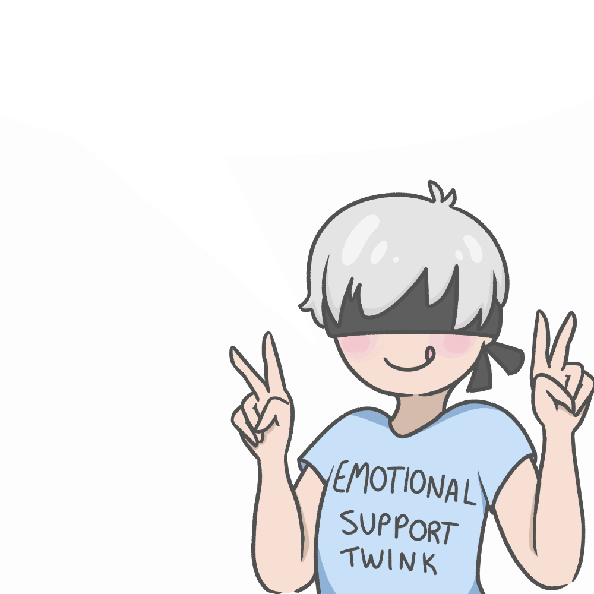
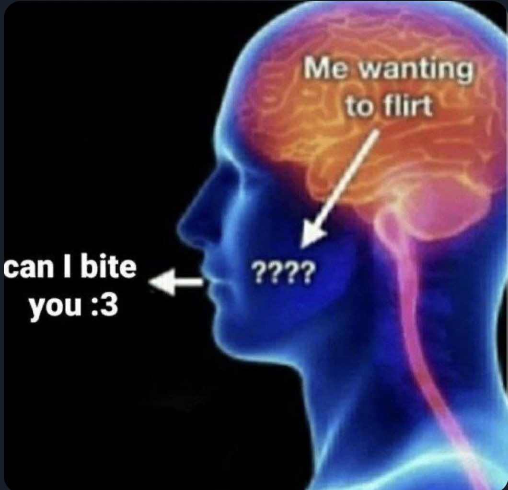

# How to Seduce Me

 

So, you've met me at a munch. Here's how to seduce me in a few easy steps.

Different people want to be made to feel different ways, and there are many ways to make them feel that way. "All approaches to human emotion and sexuality" is a broad spectrum. But seducing people, I've found, is about figuring out how people desire to be treated and seen, and why. Then you make them feel that way, in a way that few others can. Because you understand, and you've cracked the code.

 

<figure>

<figcaption aria-hidden="true">This could be you.</figcaption>
</figure>

 

Although humans are very different, there is some commonality. I'm a terrible judge of what "normal" people are looking for. But there are a lot of people a lot like me. So at least some of the tricks that work on me should work on other people.

Or maybe I gave you this document specifically so you can use it on me. Please do :)

 

<figure>

<figcaption aria-hidden="true"></figcaption>
</figure>

 

## Step 1: Gain my trust.

It's actually really easy to gain people's trust. Otherwise Ted Bundy would not have been nearly as successful. In light of that, there are two sorts of trust that you need to proceed further. I need to know that you aren't malicious, and that you're interesting to be around. After that, I find that I warm up to people pretty quickly.

### Consent

The easiest way to prove that you're not malicious is for one of my friends to introduce you. If you're a friend of a friend, then I trust my friend, so I trust you. If you hurt me you'll also damage your relationship with our mutual friend. Which, clearly, has not happened so far with anyone else. You have a track record of being reliable, so I will trust you by proxy.

The other way to prove you're not malicious is to show that you understand consent. Popular culture in general does not understand consent in the same way that we do. People seem to think that it's about not raping people. A good start, for sure. But poly kink is a whole different ball game. Much more complicated. It feels simple and natural for us, but there's a learning curve. Most people don't get it.

Consent is not a binary thing, it's a conversation. Usually a multi-hour months-ongoing conversation about what makes people tick and why. That discussion continues during play. Consent is a feeling I get. It's the trust you'll be there for me at my most vulnerable.

Here is the best explanation I've seen for the concept of consent being a conversation about trust.

* [Rope and Trust](https://www.kinbakutoday.com/rope-and-trust/)

This checklist can be a good starting point for consent conversations. They tend to meander, and that is fine and good.

* [Consent checklist (I am still trying to find the link)](https://pytorch.org/docs/stable/fsdp.html)

### Interest

You do have to catch my eye in some way. If you're a turbonormie, then gtfo. If you're reading this, you're probably not. You've got a chance.

The easiest way to make me interested in you is to be incredibly hot. Easier said than done. But I don't care about how big your tiddies are. Being conventionally attractive isn't necessary, I have different standards. But it helps to appear well put together, for any definition of "put together." Have an aesthetic. Maybe I'll like it. For example, walk around a sex dungeon in a dress with dinosaurs on it, holding a dinosaur plushie. That's an aesthetic. Now you're dinosaur girl. Incredibly hot and interesting. 10/10. Holy shit.

The other way to make me interested in you is to hit it off in conversation. Be passionate about something. That makes hitting it off a lot more likely, and if we do, that makes you interesting. If there's an attractiveness scale out of 10, which there isn't, an interesting conversation bumps you up at least three points.

 

<figure>

<figcaption aria-hidden="true">I cannot help but feel this way about interesting people.</figcaption>
</figure>

 

## Step 2: Flirt aggressively.

### Setting the mood.

It's long been known that people communicate mostly nonverbally. Even the verbal communication is less about what you're saying, and more about what words you choose and how you say them. Most of the communication bandwidth is hidden in subltle implications that act on the listener's reference frame.

Effective communication is sort of the act of mind reading. Not only is it bad if your body language tells a different story than your words, it's also bad if I'm not in the headspace to hear those words in the first place.

Guys (and especially girls with autism, and also myself) are incredibly dense sometimes. I do not pick up on it. I'm 1 for 7 on detecting flirting. Pay attention to whether I've picked up on it. If not, it may be useful to ask directly.

 

<figure>

<figcaption aria-hidden="true">As the flirter, you need to avoid this situation.</figcaption>
</figure>

 

I've actually built up a comprehensive theory of communication, but it is too complicated and too pointless to describe here. It's not very practically useful. So instead, if you want to get better at setting the mood, pay close attention to your body language and word choice. Does it convey what you want it to convey? How could it be better? More confident? More interesting? More comforting?

<figure>

<figcaption aria-hidden="true">I'm always trying to get better at my job.</figcaption>
</figure>

 

### When do I pivot?

Okay, so you've gained my trust. How do you know? Honestly, it's hard. Besides some subtle and often misleading body language there won't be many external signs. I'm pretty good at pretending to be comfortable in social situations. I imagine most people are. The best thing to do is to ask.

Before you do, it's best to know beforehand what my relationship status is, what my sexuality is, etc. Ideally towards the start of the conversation. If you don't know beforehand, that's not a dealbreaker. But if you ask at the end that makes it kinda awkward. So try to sequence these questions towards the beginning of the conversation.

Usually, I start with "Hey, I think you're cute..." and follow up with:

* Can I flirt with you?
* Can I pet your hair?
* Wanna hug?
* Can I bite you? I'll be gentle :3
* etc.

 

<figure>

<figcaption aria-hidden="true">Please? 🥺</figcaption>
</figure>

 

These are actual questions. You're asking a question that you genuinely want to know the answer to. Be ready for the answer to be no, and to potentially have a conversation about why. Or not, whatever's most comfortable. Whichever way it goes, you still probably get a friend out of the deal.

They say that "the worst they can say is no." That's obviously not true. I can do a lot worse to you. But I probably won't. Same is true of most people.

When you make your move, it's important that you're confident. Remember, bottoms want to feel wanted. It's not as effective if it seems like you just kinda sorta casually want me. It needs to be convincing. The vibe that you might want to set is something along the lines of "When I see someone cute, I tell them like it is." That way it's convincing, but doesn't come across as creepy obsession.

 

<figure>

<figcaption aria-hidden="true">You can kabedon people. I recommend it :3</figcaption>
</figure>

 

Confidence is... a skill. It's not easy. It's hard to explain. I think that confidence comes naturally when you have the right worldview.

If you feel that you live in a world where you have a low chance of success, that may be likely. And if you feel that you live in a world with a high chance of success, that too may be likely. Just don't use this fact as an excuse not to let social ques influence your thoughts, actions, feelings, etc. That's the wrong message. The right message is that from the outset you should believe that things are attainable, and update that assumption as you go. Don't just admit defeat from the beginning.

It's also true that if you don't think you can have something, you probably won't realize that you want it. Just like how people who aren't confident never consider shooting their shot, I wonder how many other things in my life I don't realize I want yet. What would I do if I have 10x as much agency? I think there's a lot of confidence to gain from pondering this question.

### After the pivot

Once you have my enthusiastic consent, be sure to take advantage of it. Touch me. Play with me. Pin me to the wall.

Or rather, that's what I would say. Unfortunately there's no play allowed at munches. Can't go further than gentle biting. Even that is really pushing it. Unfortunate. But you get the idea. Since we can't play at a munch, you should ask for my phone number and/or discord. Then we can go further than just gentle biting. I'll happily oblige.

When we meet again, we should probably talk about consent and explain our kinks to each other. Discord is a great place for these conversations, because it's often hard to explain them in person. Even people who aren't shy about their kinks often need a long time to formulate what they're saying, and edit it so the wording is right.

 

<figure>

<figcaption aria-hidden="true"></figcaption>
</figure>

 

Anyway, enjoy your new bottom 🥰
