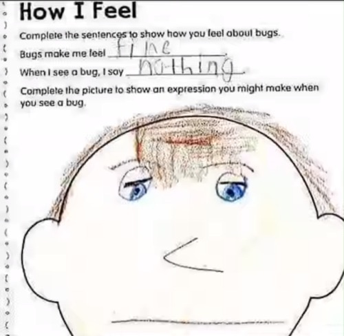
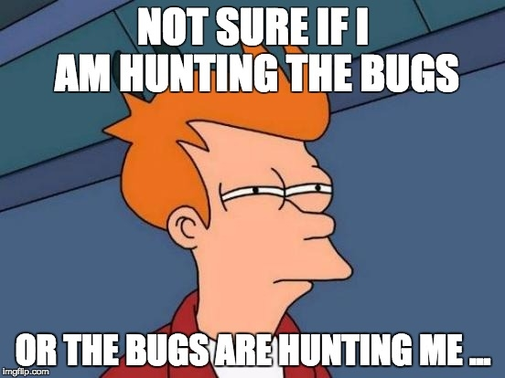
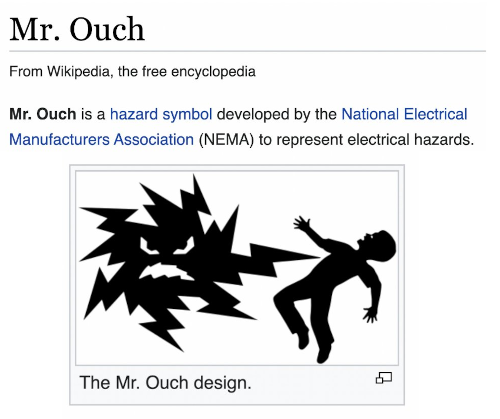

<div style="text-align: center;">

</div>

# The Craziest Bug I Have Ever Witnessed

Julia has a feature where you can report bugs and crashes from the command line. You just
run your program with `julia --bug-report=rr`, and it sends a crash report plus an `rr`
trace of the process to our servers for us to take a look at.

<div style="text-align: center;">

<br>
This is Keno's meme, and I have unabashedly stolen it.
</div>

Sometimes we get some crazy stuff. This is in fact not the first time that someone from
the Julia team has found something crazy in a crash dump. Keno Fischer wrote a similar
(and substantially more detailed) article [here](https://julialang.org/blog/2020/09/rr-memory-magic/),
where he used `rr` to debug a process where the issue turned out to be faulty memory.

Where Keno visually detailed how he found the bug, I'm just going to rant from memory.
I should have kept better records. Oh well. Live and learn.

<br>

## The Crash

Julia is a garbage collected language, writen mostly written in itself, but partially
in C and C++. The bug manifested as a random crash in function dispatch inside the
interpreter, which is also written in Julia. The function dispatch code is well tested.
When the interpreter crashes, it's generally the case that there was already memory corruption.

We contacted the user, and we asked them for the source code of the program that produced the
crash and all the data they used to run it. Graciously, they were able to provide it.

<div style="text-align: center;">

<br>
`s/println!/printf` is glorious.
</div>

Usually, my preferred method of debugging is `printf()` debugging. It's great. It's simple. It
catches most things. However, not this time. This crash was random, and hard to reproduce.
I tried to reproduce it, but I couldn't. That doesn't mean there's no bug, it just means it's
hard. So, I am forced to take the "midwit" approach and try to figure it out using the `rr`
trace.

Memory corruption bugs generally suck to find. When you're writing C, you can usually just
compile with `-fsanitize=address`. Address Sanitizer will tell you when you overwrite
memory that shouldn't be impossible to assign to within the usual confines of C or C++.
Unfortunately, the Julia runtime doesn't support being compiled with asan because it
depends on third party binaries that were *not* compiled with asan. This means that
when our binary reaches into memory allocated for variables in those libraries, asan
will throw a false positive and crash. When one part of the process is compiled with
asan, it all must be.

<br>

## Finding The Bug

Without asan as a crutch, I decided to do as my forebears did and guess.

I loaded up `rr`,
typed `bt full`, and... even after a while of gawking at it, this stack trace doesn't make
any sense. The stack trace very clearly doesn't follow the control flow of the source code.
Why? How is that possible?

Dispatch in Julia is dynamic. From where the crash happened, my initial guess was that either
a C function pointer or Julia object was written on top of another. But... how? And where?

<div style="text-align: center;">

<br></div>

Reading through the backtrace, I found that the process crashed after a `jl_call()` to
`abstract_invoke()`. That rules out that a C function pointer is the culprit. We're
looking for a Julia object written on top of another.

I was still new to the Julia codebase at this point, so for a day or two I was stuck. I
spent half an hour reading different parts of the runtime that the process was touching.
Nothing seemed to pop out at me.

New idea. I try to replicate the bug through brute force. I sshed 4 different servers,
downloaded the files, and ran the program 40 times at once with `rr`, on each machine.
Eventually a few of them crashed. Some crashed in the same way. Others crashed in different
ways. The crash almost always happened in a different place. Sometimes there was a nonsense
backtrace, and sometimes there wasn't. Sometime it crashed in Julia code, and sometimes
in C code. Often it crashed in external libraries. The bug was rare, I would get a new
trace to look through every 10 minutes or so.

Brute forcing it didn't give me the answer, but it did give me information.

Eventually, I got an `rr` trace that seemed useful. This led me to start reading the
Julia garbage collector, and at last the answer seemed obvious.

<br>

<div style="text-align: center;">

<br>
The face I made when I had the epiphany
</div>

<br>


When Julia objects are allocated, they are never relocated. They stay there forever, until
they are garbage collected or the process exits. Therefore, it is actualy impossible that an
object was written on top of another... unless it happened in the garbage collector's
allocator.

So, I set a breakpoint on `jl_gc_alloc()`, and `jl_gc_sweep()` and watched the pointers
that came out of the allocator. Sure enough, `jl_gc_alloc()` returned the same pointer
twice before `jl_gc_sweep()`. That is not supposed to happen. The question remains, why
is it happening?

When I descended deeper, I found that `jl_gc_alloc()` just calls `malloc()`, offsets the
resulting pointer, and does a bunch of bookkeeping to register the new object with the
Julia runtime. So, it was actually `malloc()` that returned the same thing twice.

... Excuse me, what? This program is single threaded!

<br>

<div style="text-align: center;">

<br>
Deliver me from this hell.
</div>

<br>


I time travelled back and set a breakpoint on `free()`. Nope. It isn't freed. Libc just
straight up returned the same pointer twice. What? How does that happen?

Collecting myself, I noted that there was an extra call to `malloc()` between the two
calls to `jl_gc_alloc()`. What is that?

When I time travelled to the next call and typed `bt` once more into `rr`, I saw that
the call to `malloc()` happened on a signal stack inside a call to `dlopen()`. Suddenly,
I knew exactly what the bug was and where.

<br>

<div style="text-align: center;">

<br>
In this moment, I felt nothing. I was numb.
</div>

<br>

## Explaination

#### How many C programmers do you know that know all of the following facts about the C runtime and can peice together they mean in aggregate?

```md
1. Dynamic linkers work by replacing calls to external libraries with trampolines
   that call `dlopen()` and `dlsym()`.

2. `dlopen()` allocates memory for the library it loads using `malloc()`.

3. `dlsym()` does not allocate memory, it only returns a pointer inside the memory
   allocated by `dlopen()`.

4. `malloc()` is not listed in `man signal-safety` as being `AS-Safe`.

5. Signal handlers interrupt the current thread herever it is, whenever it wants.
```

<br>

Most C programmers understand that the linker can do dynamic linking for you. Fewer understand
how it works, and fewer have delved further into the standard for the other information.

It is unsafe to call even AS-Safe functions from a signal handler, if the libraries they're
from have not been loaded yet. If a library is dynamically loaded inside a signal handler, it
may corrupt the allocator, which may crash the program. Or worse, like in this case, it might not.

Signal safety is a difficult topic for people wrap their heads around. `man signal-safety` is
present, but doesn't do the topic justice.

The short version of the signal safety rant is that if a function is not on the list of
allowed functions from `man signal-safety`, do not call it from a signal handler. Even
if you did not type the call yourself. If you do call something that calls something not from
that list, then understand it is undefined behavior and that you are doing so at your own
peril. It is also against the rules to modify any shared global state, or risk the same
sort of corruption.

This explanation is sufficient to avoid all issues with signal handlers, but is too
restrictive, and so it is ignored. We want to be able to do interesting things in signal
handlers, that's why they're there. So, in practice, we still have to understand the rules.

To understand why `malloc()` is not signal safe, for simplicity's sake suppose that it's
implemented something like this:
```c
void* freelist[FREELIST_SIZE];
size_t freelist_size = 0;

void free(void* p) {
  freelist[freelist_size++] = p;
}

void* malloc(size_t n) {

  void* ret = freelist[freelist_size - 1];

  /* THREAD PAUSED HERE FOR SIGNAL HANDLER */

  --freelist_size;

  return ret;
}
```

In that circumstance, when the return value is decided and the thread is paused before the
bookkeeping completes, you can see how `malloc()` would return the same thing twice. The
same thing happens inside glibc. It grabs a pointer from the freelist, but doesn't
completely erase the record of it in the same instruction. This can also lead to the
allocator getting corrupted.

<br>

## Why is this bug so hard to find?


<div style="text-align: center;">

<br>
</div>

Four things make this bug particularly insidious.

First, the bug is not even in the code the programmer wrote.  It's in code that the linker
injected, in a completely different section of the project from where the crash happens.

Specifically, the crash happened inside of function dispatch inside of LLVM ORC JIT while
compiling code that the runtime had not seen before. This was a massive red herring. LLVM
had nothing to do with the bug, it was just the first thing that requested memory after
the allocator was corrupted. Function dispatch is massively complicated, LLVM's JIT compiler
is even more complicated, and none of them were the source of the issue.

Second, the code looks totally reasonable. People don't know they are doing something
unsafe by calling ostensibly signal-safe code from a signal handler. The linker inserts
a call to `dlopen()`, and that's what calls `malloc()`. Two hidden layers. Even if you know
about one of those, you may not know about the other.

Third, Julia is a ridiculously large project. Working on Julia was the first time that I
touched a codebase too large for any one person to understand, and it changes too fast to keep
up with. It's enormously challenging to maintain a mental model of the entire project, and even
more challenging to know where to look for a bug when you don't even have a mental model. So we
are forced to rely on bug reports and tools like `rr` to help us.

Fourth, the bug is not reproducible. It only happens when the backtrace signal handler is called
during a call to `malloc()`. That can happen basically anywhere. In the original trace provided
in the bug report, `malloc()` did not crash immediately, it just returned the same pointer twice.
That allocator's bookkeeping was overwritten, but that wasn't the cause of the crash either.

The crash actually happened when the julia object that was allocated was used. Since the same
pointer was returned twice, there were two objects that were supposed to be distinct but had the
same address. By coincidence, they were both allocated in the same place, and so they had the same
type but different data, which eventually led to a crash in function dispatch.

I should also note that without making the use of multiple high end servers with 40 threads and
what I assume must be an ungodly amount of RAM, this bug would have been impossible to reproduce.
I had to run the program millions of times before I could get a single crash, and many more times
before I got a useful one.

<br>

## Squishing The Bug

<div style="text-align: center;">

<br>
Finally, it is time to squish the bug.
</div>

The fix for this bug is simple. We just need to make sure that the libraries and symbols are
loaded, so that the call to `malloc()` injected by the linker can never be executed. We can,
on the main thread before we install the signal handler, call `dlopen()` on the library, or
just call a function from the library we want to load as a no-op.

<br>

## Conclusion

Honestly, I have no conclusions. I'd never seen a bug like this before, I've not seen any since,
and I hope I never see a similar bug ever again.

I knew that something like this was possible, but it's the bug hunting equivalent of a Lovecraftian
horror rising from the depths, only to be beaten back by a coallition of sleep paralysis demons and
Mr. Ouch from those warning signs on pad-mounted transformers. It's not something you expect to see
in real life.

<div style="text-align: center;">

<br>
Mr Ouch scared me as a kid, but now I just think he's pretty neat.
</div>

I want to stop thinking about it, but I can't. It's too interesting not to share. I have to
write about it. Now that I'm no longer working on Julia full time and the blog post is written,
hopefully we can put this bug to rest.
