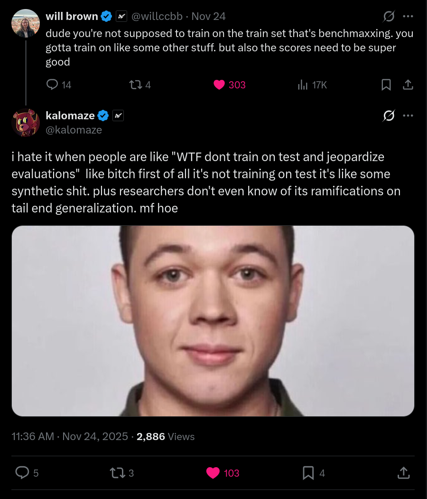

# Thoughts About LLMs, Data, and Optimization

 

 

First you select a metric. You acquire suitable data. Then you apply optimization pressure. Easy, right?

 

# Disclaimers

I'm not writing this for you, necessarily. I mean, I am. There's a reason you're reading this. But mostly I'm writing this for me. I am attempting to think from first principles, and organize my thoughts.

You may disagree with me over matters of opinion, or of framing, or of fact. Please shout your disagreements at me. You will have disagreements. And, in the words of Zach de la Rocha, if ignorance is bliss, then knock the smile off my face. Raising wrong opinions and getting publicly corrected will lead me, and perhaps others, to understanding, faster than saying nothing at all.

With that out of the way, time to spew the most asanine and disorganized non-arguments imaginable. I will not cite sources or substantiate my claims with evidence. I will get things wrong. I will not apologize.

So here are some thoughts. Some thoroughly mixed metaphors. Wrongful terminology. Some vibes.

## Yeah, it's that easy.

You select a metric and you apply optimization pressure. On suitable data. Training is training.

For LLM pretraining, this metric is next token prediction on internet data, which approximates compression of all human skills, knowledge, and practice. Or at least all of it that's on the internet. By definition this gets you basically everything you want. Lots and lots of long tail knowledge.

It also never quite gets you all the way there.

That is to say, the model learns a lot of irrelevant stuff, doesn't learn a lot of relevant stuff, probably won't predict in the manner you really want it to, and the skills and knowledge are not super accessible for solving the problems you may want to solve. Firstly because you have to prompt base models very carefully and creatively. Needs to be instruct tuned with human preferences. But also because the model is not trained to recall training data, it is doing autocomplete. It is making shit up. And memorizing a lot of extra structural stuff. Which is exactly what we asked it to do, but probably not what we want.

So, to fix these things, we apply optimization pressure. We tell it to act like a helpful assistant, and we train on factual recall to make the information more accessible. There are lots and lots of competing ways to do this. Generally some sort of online or offline reinforcement learning.

But it really is that easy.

### I knew that.

Yeah. I know you know that.

I think the deeper lesson here is that there is no magic. "We do pretraining and then we do instruct tuning and then we finetune and then we quantize" is a formula that works pretty well, but there is nothing special about it. You can rationalize why it works, but there is no proof that it's optimal, and I would be surprised if it was.

There's also nothing particularly special about helpful assistants or factual recall. This is just the direction that the big labs have decided to pursue because it's useful, economically valuable, and marketable. Also having your own personal assistant is genuinely pretty cool. It's the first thing I would build too. But there's an enitre world of alternative model personalities out there, unexplored.

 

## Datasets, Skills, Knowledge, Practice, and Objectives.

Let's go back and re-read something. I said that internet data approximates "all human skills, knowledge, and practice." At least that of it which would be on the internet.

There are some things that leaves out. Also I don't think that skills, knowledge, and practice are the same thing. I don't think this is obvious.

The common narrative is that when you instruct tune a model, you can elicit the latent knowledge of the model even if that knowledge is not in the instruct tuning dataset. Assuming that the data is diverse enough, the model learns the general capability to recall knowledge that it saw in pretraining. It generalizes.

This is True. It does do that. It does generalize. But not as well as if the pretraining data was actually in distribution. For example, doing synthetic data to reword your training data to question answer pairs and then instruct tuning on top of that is a way to improve your score on SimpleQA. The same factual data is being recalled, but it is more accessible in this format. The model doesn't have to work as hard to put two and two together from coincidental statistics.

Or so I would rationalize. I am no interpretability expert.

You may ask, is training on rephrased data cheating? Benchmaxxing? Or just smart? I would say it's just smart. Some data formats are more amenable to capabilities crystalizing out of them than others. Why would you not take advantage of that?

Suppose you want to train a model that can do tool calling. I can bet you that your base model understands what a tool is. But there's basically no chance that your model is going to generate `<tool_call>[get_weather(city='San Francisco', metric='celsius'),]</tool_call>` by accident. You need to prompt it to do so, and hope through in-context learning it generalizes. Which it probably will, some of the time.

You can use this to build a new dataset. Generate tons of rollouts, and remove the ones that aren't sensible. If you want to learn to use arbitrary user-defined tools instead of specific ones, you're also going to need to build a dataset of tools, and validate them to make sure they actually work.

Finetuning on this dataset yields a model more amenable to reinforcement learning. Now that you have a model that can generate tool calls with some reasonable degree of consistency, you can tune it to make sure it actually generates good tool calls.

The resulting model can then be used to generate tool use rollouts, and those rollouts can be filtered into a really nice dataset. You can finetune on these, and it makes RL work a lot better.

This is <a href="https://www.dbreunig.com/2025/07/30/how-kimi-was-post-trained-for-tool-use.html">what Kimi did for their tool calling post training</a>. But you can do this with just about any verifiable capability that you want to hill climb on.

 

### Claim 1. Why just SFT? Pretrain on rollouts.

You have a bunch of data now, that looks like your target domain. So why not build a pretraining dataset? Pretrain on those filtered rollouts. Then when you do RL the outputs will already look more like these trajectories.

There is evidence <a href="https://arxiv.org/abs/2510.03264">from an nvidia paper</a> that including some reasoning data in your base model, before the model is quenched, greatly benefits it in ways that SFT cannot replicate.

I hypothesize that this has downstream benefits more domains than just baking in useful reasoning patterns. I think this probably works basically no matter what your objective is, whether you're using `<think>` tags or not. It would be really surprising to me if this were not the case. But needs testing.

A very notable point that I feel compelled to make is that `<think>`ing is not RL, and RL is not `<think>`ing. Surely they are related in some meaningful sense, but you can do RL without think tags and vice-versa. Preference optimization is indeed generally a form of online or offline RL that does not involve think tags, and you can optimize for anything.

Anyway, there's a limit to how much you can pretrain on your own prechewed and regurgitated rollouts. If you retrain models on rollouts a bunch of times it probably collapse in a sense. The rollouts that you get will probably stop being meaninfully unique in some way.

Then again. If you trained multiple models to generate rollouts, each of which had different statistics, discovered different reasoning patterns, different solutions, were generated from different base models, maybe you could gain some performance in that way? You want high quality data diversity to train on, and maybe this is a way to make that happen. It could work. I presume that the best base models for RL are trained on as diverse of rollouts as possible. Worth looking into the data diversity question.

In the nearer term, I am more interested in answering questions that the Nvidia paper did not, such as "what is the roughly optimal proportion of reasoning data to include?" And, more generally, "what does the answer depend on?" I do not have a good intuition for how much it would depend on the task, versus model size or dataset statistics, versus the setting you want to optimize for, versus how much you quenched the model, and the Nvidia paper referenced above does not explore this question.

There's a lot of data experiments and ablations to do here. Lots of basic questions not answered yet.

### Claim 2. Generalization across and beyond objectives.

I can ask Deepseek R1 multi-step questions about poetry, endocrinology, niche Magic the Gathering interactions, and stuff that I know for a fact it has not seen before.

I find it interesting that this is the case. We know that the edits made my RL training are low rank, and that explains a lot of it, and they did a second phase of RL question answering on more normal-looking instruction tuning data. But but the ability to `<think>` is clearly a general capability that the model has learned to apply more generally. The math/logic/code RL taught it to do multi-step reasoning, and the RLFT helped it generalize.

The interplay here is interesting. It is a transfer of capabilities across objectives. It makes me wonder what else you can do. There are probably experiments to be done here. And experiments to be done on how best to incorporate the rollouts back into a pretraining dataset.

Another thought. The <a href="https://assets.anthropic.com/m/74342f2c96095771/original/Natural-emergent-misalignment-from-reward-hacking-paper.pdf">Anthropic reward hacking alignment generalization paper</a> is probably way more important than we understand yet. If you pull on one thing in concept space, other related things tend to follow. When I consider this, plus the I think there's a solid chance that this implies that it's possible through RL to learn capabilities and behaviors we don't understand yet, and this may transfer across objectives in ways we don't understand yet.

For this reason and others, developing fast automated interpretability tools to monitor RL training runs as they are progressing seems prudent. Another thing to look into, which I have seen no real movement on in OSS.

# Clonclusion?

IDK. Those were some thoughts and potential research directions. Consider this part one of two.

Next time I will talk about the relationship between this and entropy and RLP and self play and some more research idea vomit.
